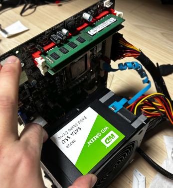
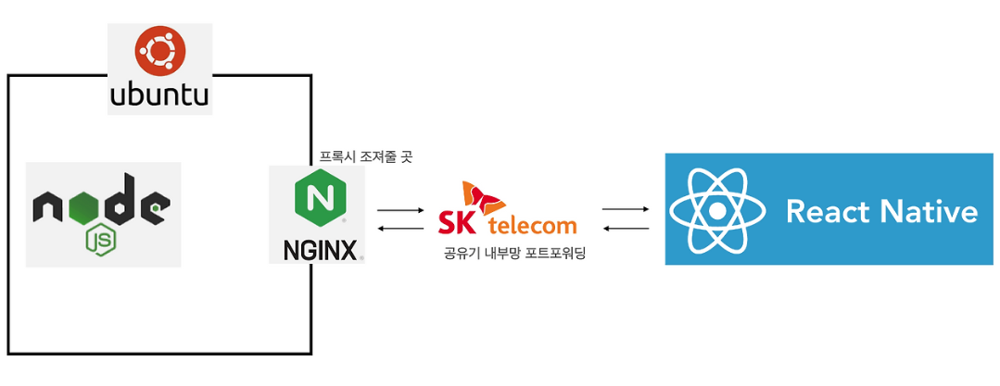
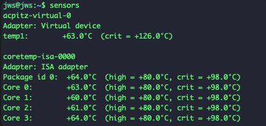
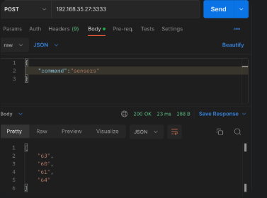
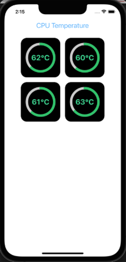
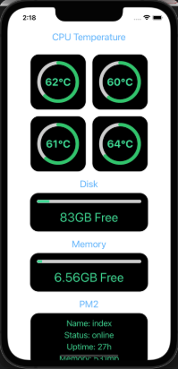

## 시작

   

AWS 비용이 많이 나가는건 아니지만 은근 내 돈으로 하자니 스트레스다.

프리티어를 돌려쓰는것도 사실 좀 귀찮아졌기에 집에서 남는 PC를 NAS겸 API 서버로 사용할겸

모니터링을 위한 앱이 하나 있으면 좋겠다고 생각했다.

간단하게 만들기위해 RN과 Node Express 조합으로쓰고 결과는 외부 DB에 저장하기로 했다.

우선 침대 높이가 높지 않아서 기존 케이스를 사용할 수 없어 나중에 잘 작동하면 사이즈 맞춰서 케이스를 제작하면 될 거 같다.

소프트웨어적인 CPU나 RAM 점유율 모니터링도 중요하겠지만 아무래도 배치가 바뀌다보니 발열에 대한 안정성 검증이 먼저였다.

   

## 소프트웨어 개발

  

Ubuntu 서버에 sensors 패키지를 설치해주고 찍어보면 아래와같이 CPU의 현재 온도를 알 수 있다.

  

어차피 동일한 PC 내에서 온도를 전달할 API 서버가 돌아갈거니 아래처럼 간단하게 구상했다.
  

  
변수가 있었는데 외부에서 확인하기 편하게 80포트와 443포트를 바로 포트포워딩 해주려했는데 SK 공유기에서 이미 해당포트를 막아뒀다.

다른 공유기 모델을 사용하거나 프록시를 생각했지만 혼자 쓰는거니 판 벌리지 않기로했다.

명령어 echo 결과를 스트링으로 가져올 수 있으니 복잡한 필터 과정을 넣기보단 일단 돌아가게 하는데만 집중했다.

<code>
if (str.includes("Core 0")) {
    return (str.substring(str?.indexOf("Core 0")
    ?.match(/\d{2,}/g)
    ?.filter((v: string) => !["80","98"].includes(v))))
}
</code>

  

  
잘 가공되어 나온다.

  
  
## 화면 구현

  

물리 CPU 4개의 온도가 잘 나오는걸 확인하고나니 UI가 많이 비어보인다. 8코어 정도면 또 모를까..

같은 방식을 이용해 나머지 부가 기능으로 화면을 채우기로했다.

Disk 용량과 RAM, 그리고 Pm2를 이용해 무중단 배포되고있는 앱들의 상태까지 나타내면 얼추 아래처럼 완료된다.

