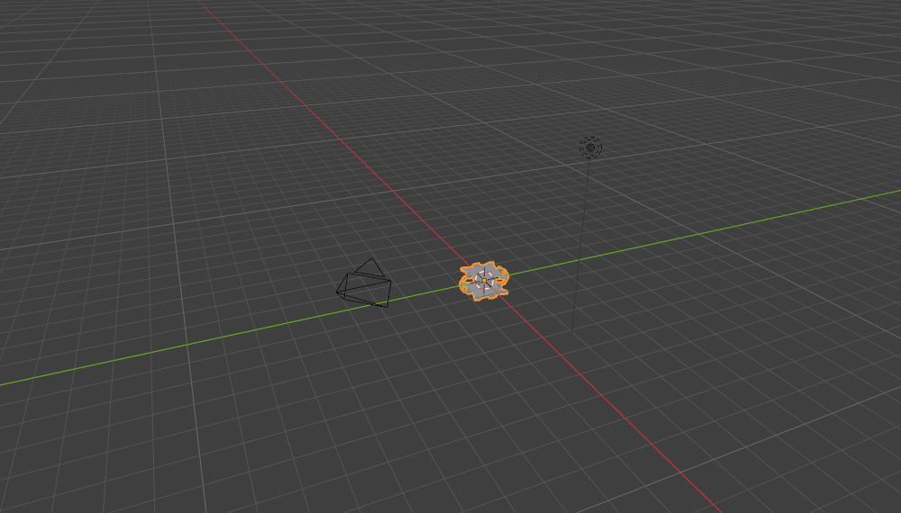
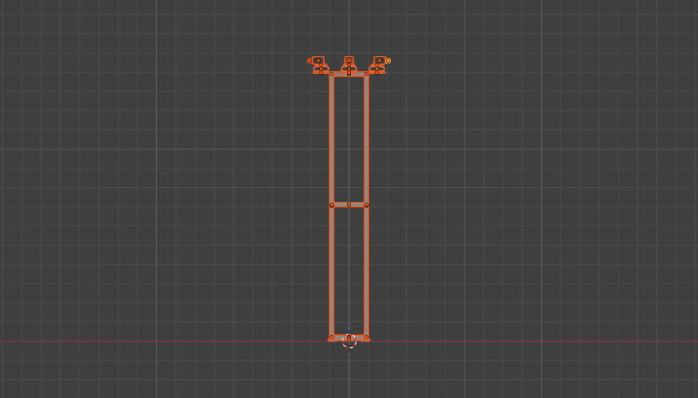
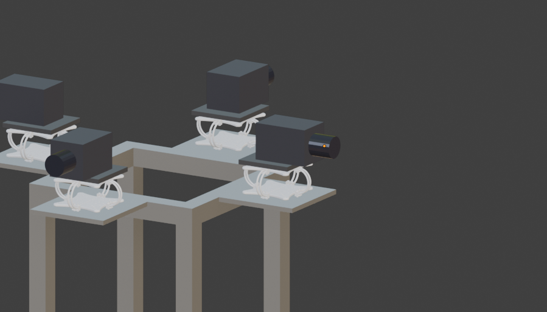
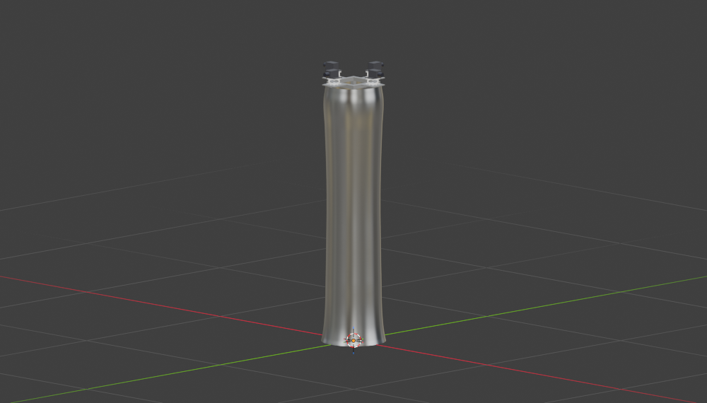
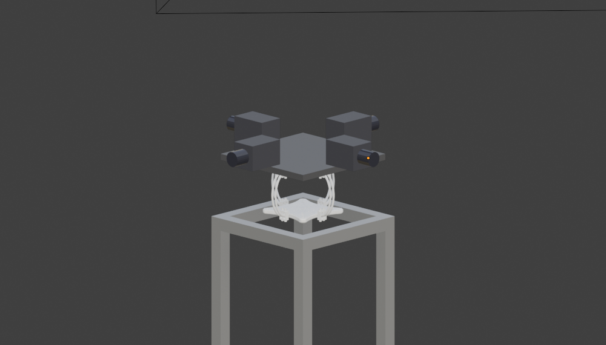
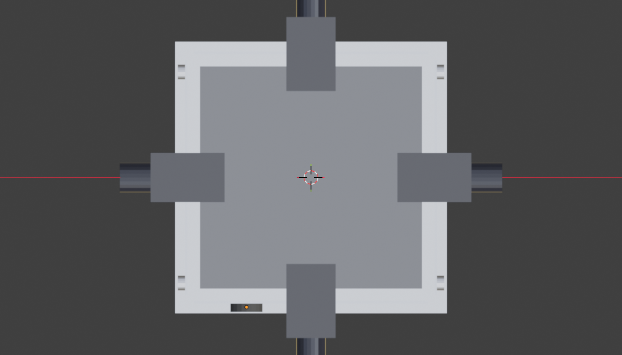
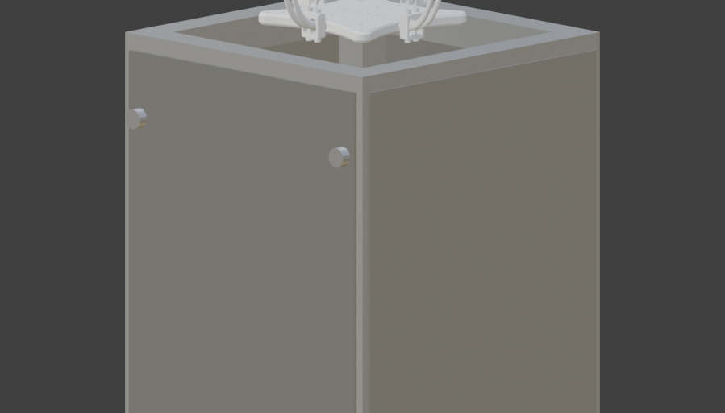

# Blender로 4방향 카메라 지그 설계하기
{: .no_toc }

로봇에 센서 붙이는 일을 하다 보니 결국 "이걸 어디에 어떻게 올릴 거냐"가 문제가 됐다.
카메라 4대를 사방으로 보게 달고, 진동은 댐퍼로 잡고, 안에는 엣지PC까지 넣어야 한다.
도면 그릴 줄은 모르니 일단 Blender를 켰다.

  
목차

  {: .text-delta }
- TOC
{:toc}

---

## 요구사항부터

받아 든 조건은 이랬다.

| 항목 | 조건 |
|:--|:--|
| 카메라 | 4대, 0° / 90° / 180° / 270° 4방향 |
| 진동 대책 | 카메라 아래에 댐퍼 |
| 골조 | 알루미늄 프로파일 |
| 전체 높이 | **1.5 m** (AMR 로봇 상판 기준) |
| 외장 | 알루미늄 골조만 두면 이상하니 커버 필요. 서빙로봇처럼 보였으면 함 |

높이 1.5m가 생각보다 큰 제약이었다. 카메라 헤드도, 댐퍼도, 안에 들어갈 것도
전부 이 안에서 나눠 써야 한다.

## 댐퍼부터 넣어봤다가

진동 댐퍼는 AI로 생성한 GLB 모델을 받아서 시작했다. 와이어로프 타입으로,
사각 플레이트 두 장을 와이어 루프 네 개가 잇는 구조다.

*임포트하자마자 뭔가 이상했다*

임포트해놓고 치수를 재보니 바운딩박스가 **1.9 m × 1.9 m × 0.82 m**였다.
지그 전체가 1.5m인데 댐퍼 하나가 1.9m다. AI 생성 모델이라 스케일이 실물과
아무 상관 없이 잡혀 있었던 거다.

{: .warning }
> 외부에서 받아온 모델은 일단 치수부터 재보고 시작하는 게 맞다.
> 형상은 멀쩡한데 스케일만 엉뚱한 경우가 생각보다 흔하다.

실사용 치수로 리스케일해서 다시 앉혔다.

## 골조 세우기

2020(20 × 20 mm) 알루미늄 프로파일 기둥 4개를 200 × 200 mm 풋프린트로 세우고,
하단·중단·상단 3단 브레이스 링으로 묶어 강성을 확보했다.
바닥은 220 × 220 × 10 mm 베이스 플레이트에 AMR 상판 볼팅용 M6 홀 4개.

*기둥 4개 + 3단 브레이스. 위쪽에 카메라 아웃리거가 달려 있다*

상단은 등대처럼 만들었다. 최상단 브레이스 링 4면에 선반을 내밀고,
각 선반마다 댐퍼 → 마운트 플레이트 → 카메라 순으로 쌓았다.

*방향마다 댐퍼를 하나씩 뒀던 초기 구성*

댐퍼가 항상 수평으로 놓이니 카메라가 어느 방향을 보든 진동을 똑같이 흡수한다.
여기까진 괜찮아 보였다.

## 커버를 만들다 간섭이 났다

골조만 있으면 앙상하니 커버를 씌우기로 했다. 스테인리스 라운드 쉘로,
서빙로봇 바디에서 흔히 보이는 유기적인 라인을 노렸다.

베지어 프로파일 곡선을 하나 그리고 360° 회전(Screw)시켜 회전체를 만든 다음,
Solidify로 3mm 판재 두께를 줬다. 하단은 지름 340mm로 넓게 벌어졌다가
허리에서 살짝 잘록해지고 어깨에서 다시 부푸는 화병형이다.

*모양은 그럴듯하게 나왔다*

그런데 커버가 골조를 실제로 안 건드리는지 다시 계산해보니 문제가 있었다.

{: .problem }
> 허리 부분(z = 0.75 m)에서 프레임 포스트 **모서리** 반지름이 141.4 mm인데
> 셸 내벽은 137 mm였다. 4.4 mm 겹친다.

원인은 단순했다. 커버 곡선을 잡을 때 기준으로 삼은 127mm는 포스트까지의
거리였는데, 실제로 제일 바깥으로 나오는 건 포스트의 **모서리**다.
기둥이 (±100, ±100)에 서 있으니 대각선 방향으로는 `100 × √2 ≈ 141.4 mm`까지 나온다.
원통형 셸은 방향을 안 가리니, 이 대각선이 가장 불리한 지점이 된다.

프로파일 곡선을 다시 잡아 어디서든 최소 **13.6 mm** 여유를 확보하는 걸로 고쳤다.

## 댐퍼 4개가 1개가 됐다

여기서 요구사항이 바뀌었다. 실제 구매할 댐퍼는 **130 × 130 × 90 mm** 하나이고,
그 위에 카메라 4대를 전부 올린다는 것. 그리고 허리에 엣지PC용
**150 × 150 × 150 mm** 공간을 확보해야 한다.

| 항목 | 변경 전 | 변경 후 |
|:--|:--|:--|
| 댐퍼 | 80 × 80 × 35 mm × **4개** | 130 × 130 × 90 mm × **1개** |
| 카메라 배치 | 방향별 개별 선반 | 공용 마운트 플레이트(180 × 180 mm) 가장자리 |
| 엣지PC 공간 | 없음 | 150 × 150 × 150 mm |
| 기둥 높이 | 1.5 m | **1.36 m** |

댐퍼가 90mm로 두꺼워진 만큼 기둥을 1.36m로 줄여서 전체 높이 1.5m를 그대로 맞췄다.

*댐퍼 하나 위에 공용 플레이트를 얹고 카메라 4대가 각자 다른 방향을 본다*

### 엣지PC 여유가 5mm밖에 없다

이건 지금도 해결 못 한 부분이다. 기둥 4개 안쪽 간격이 160 × 160 mm인데
150 × 150 mm PC를 넣으면 사방 여유가 **5 mm**다.

방열이나 커넥터 돌출부를 생각하면 빠듯하다 못해 안 들어갈 수도 있다.
기둥 간격을 넓히면 지그 전체 폭이 커지고, PC를 눕히면 높이를 더 먹는다.
실물 PC 규격을 확인하기 전까진 그냥 표시만 해두기로 했다.

## 원형 커버를 걷어냈다

모양은 마음에 들었는데, 만들어놓고 보니 치명적인 문제가 있었다.
**정비를 하려면 어디를 열어야 하나.**

회전체 셸이라 통짜다. 작은 해치를 하나 뚫어놨지만, 안에 150mm짜리 PC가 들어가는데
그 구멍으로 손을 넣어 케이블을 만질 수는 없다.

{: .problem }
> 원형 셸은 예쁜데 열리지 않는다. 유지보수를 생각하면 애초에 잘못된 형태였다.

그래서 셸을 통째로 버리고 **ㄱ자(앵글) 패널 4장**으로 다시 만들었다.
각 패널이 포스트 코너 하나를 감싸면서 양옆 면을 90mm씩 덮는 구조다.

*패널 4장이 코너를 하나씩 물고, 이음선은 각 면 중앙에만 생긴다*

- 코너는 이음새 없이 매끈하고, 세로 이음선은 평면 중앙에만 생긴다
- 상단 캡티브 손나사 2개 + 하단 로케이팅 탭
- 나사 2개만 풀면 패널을 위로 들어 올려 통째로 분리

*손나사 2개가 패널을 잡고 있다*

패널 하나만 떼면 코너 하나 + 양쪽 반쪽 면이 통째로 열린다.
따로 해치를 뚫을 필요도 없어져서 그건 지웠다.

## 최종 구성

| 항목 | 값 |
|:--|:--|
| 전체 높이 | 1.50 m |
| 기둥 | 2020 알루미늄 프로파일 4개, 1.36 m |
| 풋프린트 | 200 × 200 mm |
| 베이스 플레이트 | 220 × 220 × 10 mm, M6 홀 4개 |
| 댐퍼 | 130 × 130 × 90 mm × 1 |
| 카메라 | 4대 (0° / 90° / 180° / 270°) |
| 엣지PC 베이 | 150 × 150 × 150 mm (여유 5 mm) |
| 커버 | 3 mm 스테인리스 ㄱ자 패널 4장 |
| 씬 오브젝트 | 45개 (골조 15 · 카메라부 9 · 커버 17 · 댐퍼 1 · 소스 1 + 기본 2) |

<!-- TODO(수치): 실제 제작 후 지그 무게와, 주행 중 카메라 진동 진폭을 재서 추가 -->

## 마치며

3D로 미리 그려본 게 확실히 값어치를 했다. 허리 간섭 4.4mm는 실물을 깎고 나서
알았으면 판재를 통째로 다시 떠야 했을 거고, 엣지PC 여유 5mm도 조립하다 알았으면
그때부터 기둥을 다시 잘라야 했다.

제일 크게 배운 건 **예쁜 형상과 정비 가능한 형상은 다르다**는 거였다.
회전체 셸은 렌더링으로 보면 서빙로봇 같아서 만족스러웠는데,
"이거 어떻게 열어요"라는 질문 하나에 통째로 무너졌다.
ㄱ자 패널은 확실히 덜 매끈하지만, 나사 두 개로 면 하나가 통째로 열린다.

Blender를 도면 도구로 쓰는 것도 나쁘지 않았다. 정식 CAD가 아니라
공차나 체결 계산은 못 하지만, "부딪히나 안 부딪히나"와 "손이 들어가나"를
눈으로 확인하는 데는 충분했다.

다음엔 이런 걸 해보면 좋겠다.

- **실물 댐퍼 모델로 교체** — 지금 쓴 건 AI 생성 GLB를 억지로 리스케일한 거라, 130 × 130 × 90 mm에 맞추면서 와이어 루프 비율이 눌렸다. 실제 구매 제품 도면으로 바꿔야 한다.
- **엣지PC 실측 후 재배치** — 5mm 여유는 사실상 없는 것과 같다. 방열 여유까지 넣으려면 기둥 간격을 다시 봐야 한다.
- **FreeCAD 같은 진짜 CAD로 옮기기** — 체결 부품과 공차를 제대로 다루려면 결국 필요할 것 같다.
- **진동 시뮬레이션** — 댐퍼를 하나로 몰았으니 4개일 때와 감쇠 특성이 다를 텐데, 지금은 감으로만 넘어갔다.
