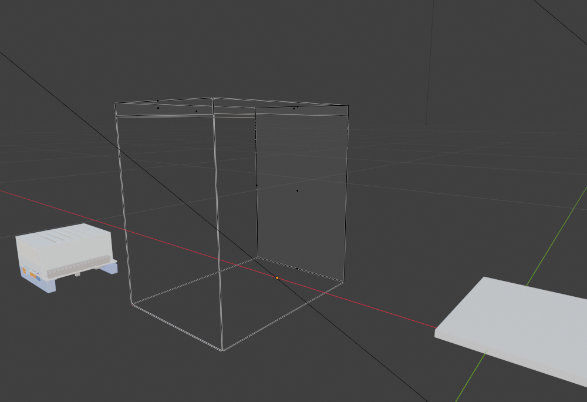
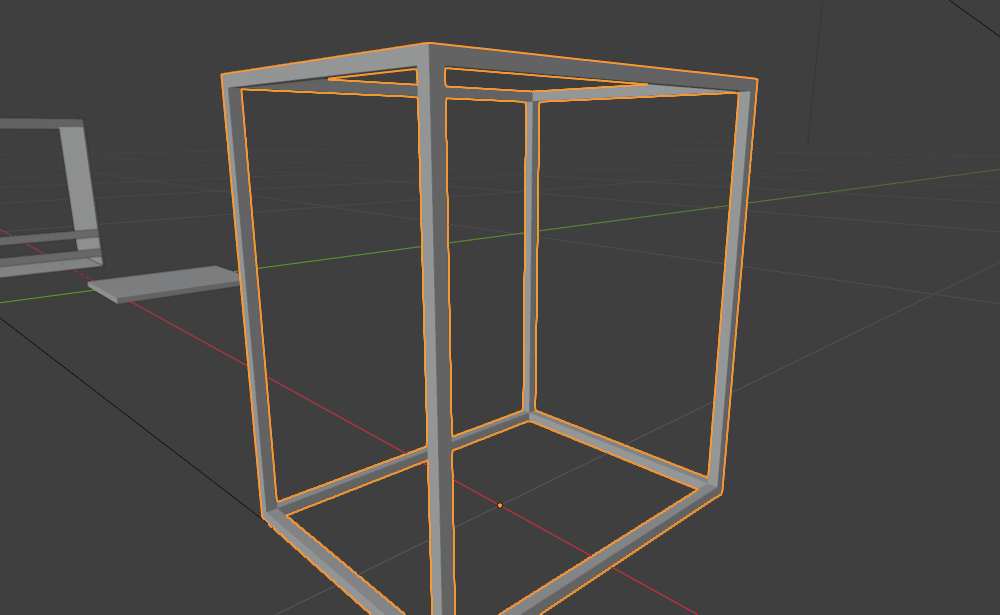
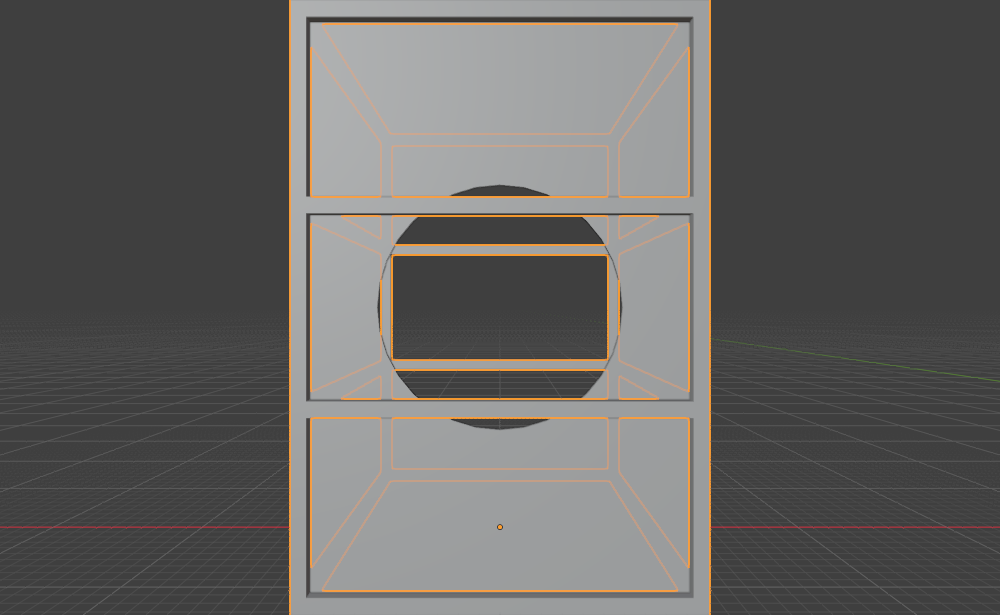

# 홈서버 케이스를 직접 짜보기 (w/ Blender)
{: .no_toc }

[남는 PC를 홈서버로 만들면서](../software/home-server-monitoring.html) 케이스를 벗겨
침대 밑에 눕혀뒀다. 그때 "나중에 잘 작동하면 사이즈 맞춰서 케이스를 제작하면 될 거 같다"고
써놨는데, 그 나중이 왔다.

  
목차

  {: .text-delta }
- TOC
{:toc}

---

## 왜 만들려고 했나

발열은 [모니터링 앱](../software/home-server-monitoring.html)으로 확인해서 60도 초반으로
안정적이었다. 문제는 그게 아니라 **먼지와 케이블**이었다.

케이스 없이 보드가 그냥 노출되어 있으니 침대 밑 먼지를 그대로 뒤집어쓴다.
그렇다고 기성 케이스를 사자니 침대 프레임 높이에 안 맞아서 애초에 벗긴 거였다.

시중 제품 중에 메쉬망 없이 프레임만 있는 오픈형 베어본을 찾아보고,
Jonsbo C6-ITX 같은 소형 케이스도 참고했다. 결국 필요한 건
"내 보드 치수에 맞는 뼈대"라서, 직접 짜보기로 했다.

## 일단 박스부터

Blender는 지그 설계하면서 조금 만져봤지만, 여전히 초보다.
먼저 보드와 파워 위치를 대충 잡고 전체 부피를 박스로 세웠다.

*왼쪽이 메인보드, 오른쪽이 파워. 가운데 와이어프레임이 대략의 케이스 크기*

여기서부터가 진짜 시작이었다. 박스 하나 만드는 건 쉬운데,
그걸 **프레임(뼈대)으로 바꾸는 것**이 문제였다.

## Solidify로 뼈대 만들기

메쉬망 없이 모서리만 남은 프레임을 만들려면, 박스의 면을 지우고
남은 엣지에 두께를 주면 된다. 이때 쓰는 게 Solidify 모디파이어다.

*면을 다 지우고 모서리에만 두께를 준 상태. 이제 좀 케이스 같다*

여기까지 오는 데 헤맨 지점들이 있었다.

### 면을 채우려면 정점부터 골라야 한다

프레임 위쪽에 좁은 틀을 짜뒀는데, 그 틀 안을 막고 싶었다.
Solidify로 되는 건 줄 알았는데 아니었다. Solidify는 **이미 있는 면**에
두께를 주는 거지, 없는 면을 만들어주지는 않는다.

면을 만들려면 Edit Mode에서 정점이나 엣지를 골라 `F`를 누르면 된다.
정점 두 개면 엣지가, 세 개 이상이면 면이 만들어진다.

{: .note }
> 원하는 위치에 정점을 그냥 찍을 수는 없고, 루프컷(`Ctrl+R`)으로 면을 나누거나
> 기존 엣지를 subdivide 해서 만들어야 한다. 이걸 몰라서 한참 헤맸다.

### 프레임이 사라지는 문제

한 번은 기둥으로 쓰던 프레임이 통째로 없어졌다. 원인은 모디파이어였다.
Solidify와 Boolean이 겹쳐 있는 상태에서 원본 메시를 편집하니
결과가 엉뚱하게 나온 거다.

이제 더 바꿀 일이 없다 싶으면 `Ctrl+A` → Visual Geometry to Mesh로
모디파이어를 적용해서 하나의 메시로 굳혀두는 게 편했다.

## 후면 팬 구멍 뚫기

후면은 일반 PC처럼 막고 팬 구멍을 냈다. 구멍은 Boolean 모디파이어로 뚫는다.
원기둥(cutter)을 하나 만들어 패널에 겹쳐놓고 Difference로 빼면 된다.

*가운데 원형이 팬 구멍. 위아래로 가로 보강 프레임을 넣었다*

### Array가 본체를 복사해버렸다

팬 그릴처럼 작은 구멍을 격자로 여러 개 뚫고 싶었다.
커터에 Array 모디파이어를 10 × 20으로 걸면 될 것 같았는데,
막상 하니까 **구멍이 아니라 본체 전체가 복사됐다.**

원인은 순서였다. 커터 오브젝트가 아니라 패널 쪽에 Array가 걸려 있었다.

{: .problem }
> Boolean은 "패널 ← 커터"의 관계인데, 배열을 패널에 걸면 패널이 늘어난다.
> 늘려야 하는 건 커터 쪽이다.

커터 오브젝트를 선택하려는데 뷰포트에서 클릭이 안 되는 것도 문제였다.
Boolean 커터는 보통 화면에서 숨겨두는데(Display As: Wire / Hide in Viewport),
숨겨진 오브젝트는 클릭으로 못 잡는다. 아웃라이너에서 직접 고르거나
선택 잠금(마우스 커서 아이콘)을 풀어야 한다.

정리하면 이 순서다.

1. 아웃라이너에서 커터 오브젝트를 선택 (뷰포트 클릭 ✕)
2. 선택 잠금이 걸려 있으면 해제
3. **커터에** Array 모디파이어 두 개를 걸어 X 10개 · Y 20개로 격자 생성
4. 패널의 Boolean 모디파이어가 그 커터를 참조하도록 지정

## Blender를 만지며 배운 것

기능보다 개념을 몰라서 헤맨 게 대부분이었다. 정리해두면 이렇다.

| 하고 싶은 것 | 방법 |
|:--|:--|
| 엣지 두 개로 면 만들기 | Edit Mode에서 선택 후 `F` |
| 원하는 위치에 정점 추가 | 루프컷 `Ctrl+R` 또는 엣지 subdivide |
| 판재에 두께 주기 | Solidify (단, 면이 이미 있어야 함) |
| 구멍 뚫기 | 커터 오브젝트 + Boolean(Difference) |
| 구멍을 격자로 반복 | **커터에** Array 모디파이어 |
| 숨긴 커터 선택 | 아웃라이너에서 선택 |
| 모디파이어 확정 | `Ctrl+A` → Visual Geometry to Mesh |

<!-- TODO(이미지): 최종 프레임 렌더 + 실제 보드를 넣은 조립 상태 -->
<!-- TODO(수치): 완성 프레임의 외형 치수와 침대 프레임 아래 여유 높이 -->

## 마치며

[카메라 지그](./camera-jig-blender.html)를 만들 때는 스크립트로 치수를 박아서
만들었는데, 이번엔 뷰포트에서 직접 만지다 보니 오히려 더 많이 배웠다.
모디파이어가 왜 순서를 타는지, 왜 커터를 숨겨두면 클릭이 안 되는지 같은 건
직접 부딪혀야 알게 되는 것들이었다.

아직 완성은 아니다. 프레임 골격까지는 나왔는데 실제 보드 치수를 정확히 재서
마운트 홀 위치를 잡는 작업이 남았고, 그다음이 제작이다.
3D 프린터로 코너 조인트만 뽑고 나머지는 알루미늄 프로파일로 짜는 게
제일 현실적일 것 같다.

무엇보다, 침대 밑에서 먼지 뒤집어쓰고 있는 보드를 볼 때마다
마음이 불편했는데 이제 뭔가 하고 있다는 것만으로 좀 낫다.

다음엔 이런 걸 해보면 좋겠다.

- **실측 후 마운트 홀 배치** — 지금은 보드 크기를 눈대중으로 잡았다. ATX 규격 홀 위치를 그대로 따와야 한다.
- **먼지 필터 자리 만들기** — 애초에 이걸 하려고 시작한 일이다. 흡기 쪽에 필터를 끼울 홈을 넣고 싶다.
- **3D 프린팅으로 코너 조인트 출력** — 프레임 전체를 뽑기엔 크니까 조인트만.
- **발열 재측정** — 케이스를 씌우면 공기 흐름이 달라진다. 60도 초반이 유지되는지 다시 봐야 한다.
