# 시작하기 - Hello ROS
{: .no_toc }

조립 PC조차 못 만드는 나에게 로봇 개발이라는 업무가 주어졌다. 단순 자료조사인 줄 알았는데
주 업무가 될 줄은 몰랐다. ROS라는 단어를 처음 검색해 본 날부터, 브라우저에서 그린 지도 위로
로봇 경로를 뽑기까지 이어진 이야기다.

<details open markdown="block">
  <summary>목차</summary>
  {: .text-delta }
- TOC
{:toc}
</details>

---

## ROS가 뭔데

처음에 던져준 키워드는 ROS 하나였다.

Robot Operating System. OS라고 하면 Linux, Mac, Windows만 생각했는데 이런 놈은 또 처음 들어본다.
찾아보니 대충 로봇 개발을 위한 오픈소스 소프트웨어 플랫폼이란다. 서로 각자 개발했던 로봇
플랫폼을 하나로 통일해서 쓸 수 있게 해주는 미들웨어라고 생각하면 된다.

다행히 OS 자체를 밀어버리고 설치할 필요는 없었다. 기존 OS 위에 얹기만 하면 되고
우분투 기반이라 러닝커브도 비교적 낮은 편이었다.

그런데 처음 예제를 찾아보는데 버전명부터 튜토리얼까지 죄다 거북이뿐이라, 거북이를 참 좋아하는
사람들이구나 싶었다. 진심이었다. 새 버전은 5월 23일 **세계 거북이의 날**에 나온다.

당시 Docker 옹호론자였던 나는 따로 OS를 설치하기도 귀찮고 배포 문제도 염두에 둬서
그냥 컨테이너로 띄워 작업하기로 했다.

**작업 환경**

| 항목 | 값 | 고른 이유 |
|:--|:--|:--|
| 배포판 | ROS2 Humble Hawksbill | EOL 시점과 자료 점유율 |
| 이미지 | `osrf/ros:humble-desktop-full` | 오픈로보틱스 공식. 튜토리얼 그대로 돌아감 |
| 실행 | Docker 컨테이너 | 호스트 OS를 안 건드리고 배포까지 고려 |

오픈로보틱스에서 만들어둔 이미지 덕에 기본 튜토리얼을 실행하는 데는 문제가 없었다.
토픽이라는 걸 발행하는 쪽과 구독하는 쪽 두 영역으로 나뉘어 있는데, 이런 통신 방법으로
데이터를 주고받는 구조다.

## 실습 - 거북이 움직이기

튜토리얼에는 Talker와 Listener가 있는데, 이걸 두 컨테이너로 띄워 통신하는 예제였다.
얼추 여기까지 진행했으면 세팅은 끝났다 생각하고, GUI에서 turtlebot(거북이 참 좋아한다)
패키지를 설치해 튜토리얼을 실행했다.

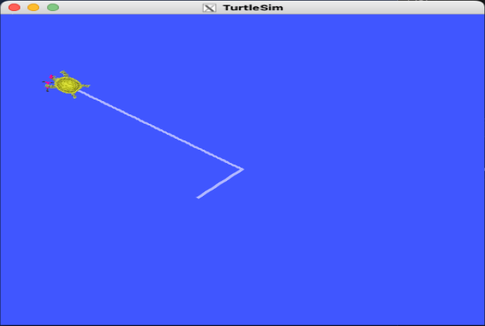
*거북이가 잘 나오고 잘 돌아다닌다*

거북이를 보여주는 패키지와 거북이를 움직이는 패키지를 따로 실행해야 해서,
작업하다 보면 터미널이 참 많이 필요하다.

그럼 거북이를 움직이는 쪽은 어떤 토픽을 발행하고 있을까 싶어 들여다봤다.

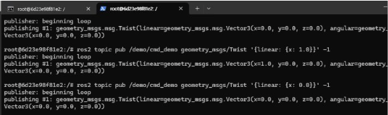
*직선속도(linear)와 각속도(angular)를 실어 보낸다*

직선속도와 각속도를 토픽으로 발행하면 그 시간만큼 거북이가 움직인다.
어떤 값을 입력받아 움직이는지 알았으니, 이제 밖에서 제어해볼 차례다.

## 밖에서 거북이 조종하기

생각한 프로세스는 이랬다.

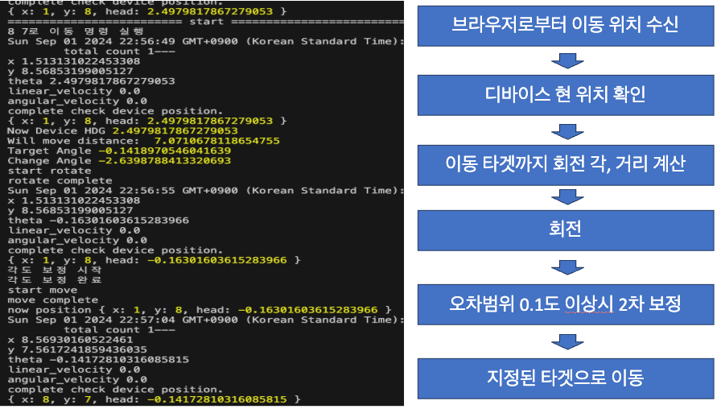
*브라우저에서 목적지를 받아 → 현재 위치 확인 → 회전각·거리 계산 → 회전 → 보정 → 직진*

로직이 정리됐으니 프론트를 붙인다. 튜토리얼은 맵 크기가 **10 × 10**으로 고정되어 있어
프론트에서도 10칸씩만 레이아웃을 구성했다.

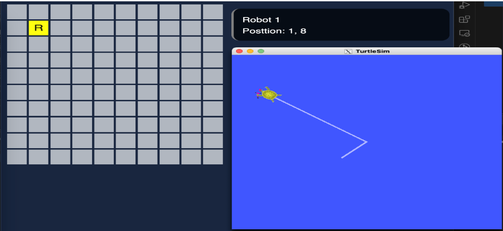
*왼쪽 그리드에서 칸을 찍으면 오른쪽 거북이가 그리로 간다*

좌표값으로 한 칸씩 직선 이동시키는 건 간단한데, 최단경로로 가려면 대각선으로도 움직일 수
있어야 한다. 그래서 `theta`값으로 목적지까지의 회전각을 구하고, 그만큼 회전시킨 뒤
직선으로 이동하도록 했다.

```javascript
const getAngle = (x1: number, y1: number, x2: number, y2: number) => {
  return Math.atan2(y2 - y1, x2 - x1);
};

const distance = Math.sqrt(
  (currentX - targetX) ** 2 + (currentY - targetY) ** 2
);

const angle = getAngle(currentX, currentY, targetX, targetY);
console.log("Target Angle", angle);

let result = normalizeAngle(angle - position.head);
console.log("Change Angle", result);
```

### 토픽을 바로 쏘고 싶었지만

계산은 브라우저에서 끝났는데, 정작 토픽을 발행하는 게 걸림돌이었다.
`rclpy`를 쓰려면 결국 파이썬 코드를 따로 작성해야 하고, JS 라이브러리도 있긴 하지만
ROS2가 설치되어 있어야 하는 데다 버전까지 맞아야 하는 등 조건이 붙었다.

라이브러리 버전 맞추다 하루를 다 쓸 것 같았다. 처음이니까 일단 굴러가는 게 먼저다 싶어서
노드에서 ROS2 CLI를 직접 `execute` 하는 쪽으로 우회했다. 깔끔한 방법은 아니지만
검증 단계에선 이게 제일 빨랐다.

### 회전각이 조금씩 어긋난다

돌려보니 회전 명령을 준 만큼 정확히 돌지는 않았다. 한두 번은 티가 안 나는데,
목적지를 여러 번 찍다 보면 오차가 누적돼서 슬금슬금 엉뚱한 데로 간다.

그래서 회전이 끝나면 현재 헤딩을 다시 읽어, 목표각과의 차이가 **0.1도** 이상일 때
한 번 더 보정하도록 했다. 위 흐름도의 다섯 번째 박스가 그거다.

이렇게 프론트에서 GUI로 목적지를 설정하면 실제 ROS 환경에서 거북이가 움직이는 걸
확인할 수 있게 됐다.

## Gazebo로 넘어가기

가제보는 로봇 시뮬레이션 프로그램이라고 생각하면 편하다.
기존 turtlesim에서는 2D 거북이만 보였지만, 이제 3D 환경에서 다양한 오브젝트를 두고
거북이 말고 다른 모양으로 로봇을 커스텀해서 시뮬레이션해볼 수 있다.

블로그대로 설치하고 튜토리얼을 실행하면 이런 화면이 나온다.

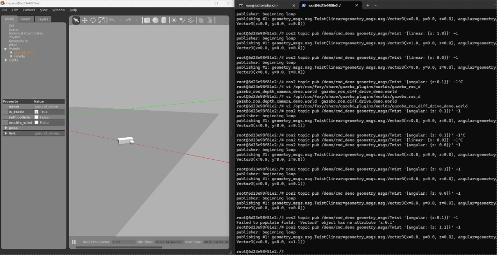
*2D 거북이에서 3D 시뮬레이터로*

### 맵을 손으로 만드는 게 너무 귀찮았다

맵을 하나씩 만들어야 하는데, GUI에서 오브젝트를 일일이 배치하는 게 보통 일이 아니었다.
장애물 하나 옮기려고 마우스를 몇 번씩 끌어야 한다.

어차피 앞에서 프론트로 거북이를 조종해봤으니 맵도 같은 방식으로 만들면 되지 않을까 싶었다.
브라우저에서 마우스로 그리드를 칠하면 그게 장애물이 되도록 하고, 칠한 격자를 2차원 배열로
바꾼 다음, 그 배열을 Gazebo의 `.sdf` XML로 파싱해서 `1`인 자리마다 wall 모델을 꽂아 넣는
방식이다.

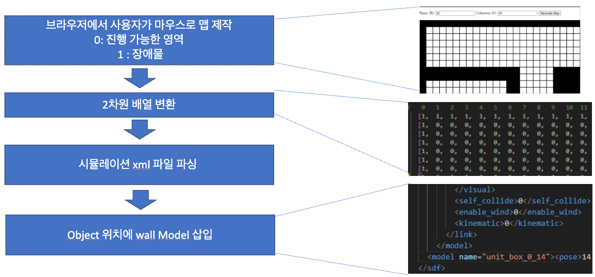
*브라우저 그리드 → 2차원 배열 → sdf 파싱 → wall 모델 삽입*

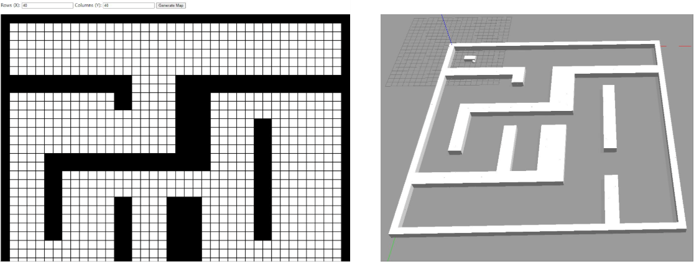
*40 × 40 격자로 그린 미로가 그대로 3D world로 떨어진다*

마우스로 대충 그린 미로가 3D로 튀어나오는 걸 보니 꽤 그럴듯했다.

## BFS로 경로 짜기

맵이 이미 배열로 존재하니 최단경로 탐색을 붙이기도 좋았다. 0은 갈 수 있는 칸, 1은 장애물이다.

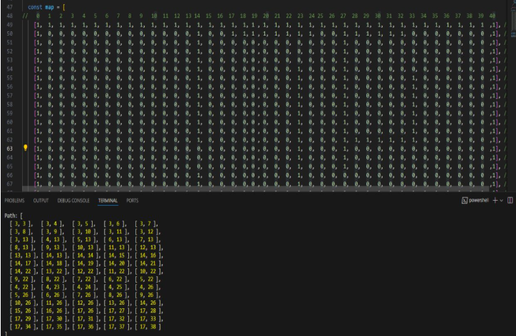
*좌표 배열로 경로가 떨어진다*

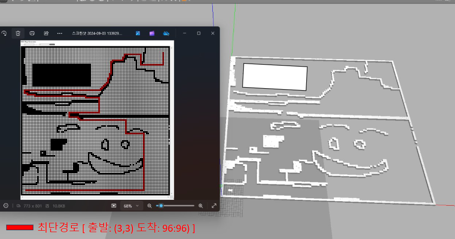
*출발 (3, 3) → 도착 (96, 96). 격자를 크게 잡아도 경로가 나온다*

### 경로는 나오는데 로봇이 못 지나간다

문제는 여기서 나왔다. 격자 한 칸 기준으로 BFS를 돌리면 폭이 1~2칸인 좁은 통로도
"갈 수 있는 길"로 잡히는데, 정작 실제 로봇은 그 통로에 몸이 안 들어간다.

{: .problem }
> 경로 탐색을 점(point) 기준으로 짜다 보니 로봇에 부피가 있다는 걸 잊고 있었다.
> 화면 안에서만 개발하면 이런 걸 자꾸 빼먹는다.

그래서 로봇을 **3 × 3 셀** 크기로 잡고, 이동 후보 칸마다 로봇 폭만큼의 영역이 전부
비어 있는지 검사하는 `canMove()`를 통과한 칸만 큐에 넣도록 바꿨다.

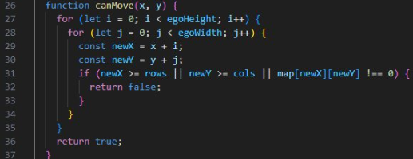
*로봇 크기(egoWidth × egoHeight)만큼 훑어서 하나라도 막혀 있으면 false*

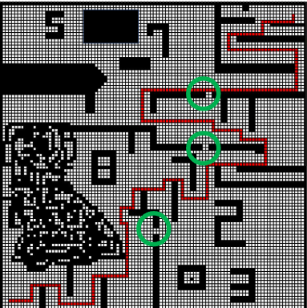
*초록 동그라미가 2칸짜리 통로. 최단거리지만 로봇이 못 들어가서 경로에서 빠졌다*

테스트해보니 의도대로 2칸짜리 공간은 경로 계획에서 빠졌다.

## 여기까지 정리하면

| 항목 | 값 |
|:--|:--|
| ROS 배포판 | Humble (Docker `osrf/ros:humble-desktop-full`) |
| turtlesim 맵 | 10 × 10 |
| GUI 맵 에디터 | 40 × 40 이상의 격자 |
| 경로 탐색 | BFS, 출발 (3,3) → 도착 (96,96) 확인 |
| 로봇 점유 크기 | 3 × 3 셀 |
| 회전 보정 기준 | 목표각 오차 0.1° |

<!-- TODO(수치): 격자 크기별 BFS 탐색 시간(ms)을 재서 넣기 -->

## 마치며

로봇 개발이라고 해서 뭔가 대단한 게 있는 줄 알았는데, 여기까지는 결국 전부
"좌표 받아서 각도 계산하고 명령 쏘기"였다. 생각보다 익숙한 일이었다.

오히려 발목을 잡은 건 로봇에 **부피가 있다**는, 너무 당연해서 코드로 옮길 생각을
못 한 쪽이었다. 모니터 안에서만 개발하다 보면 이런 걸 자꾸 놓치게 되는 것 같다.

`rclpy` 대신 CLI를 `execute`로 때린 것도 계속 마음에 걸린다. 검증용으론 충분했지만
명령 하나 쏠 때마다 프로세스가 뜨는 구조라 오래 갈 방식은 아니다.

다음엔 이런 걸 해보면 좋겠다.

- **rosbridge + roslibjs로 갈아타기** — CLI `execute` 우회를 걷어내고 웹소켓으로 직접 토픽을 주고받고 싶다.
- **BFS 대신 A\*** — 격자가 커지면 탐색 비용도 같이 커질 텐데, 휴리스틱을 넣으면 실제로 얼마나 줄어드는지 재보고 싶다.
- **회전 보정을 P 제어로** — 지금은 "0.1도 넘으면 한 번 더"라는 단순 보정인데, 오차에 비례해서 각속도를 주면 훨씬 부드러울 것 같다.
