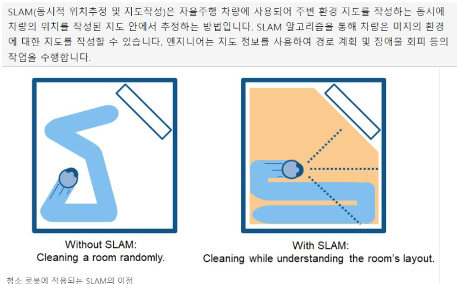
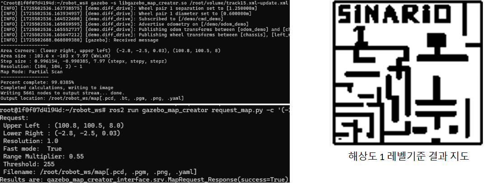
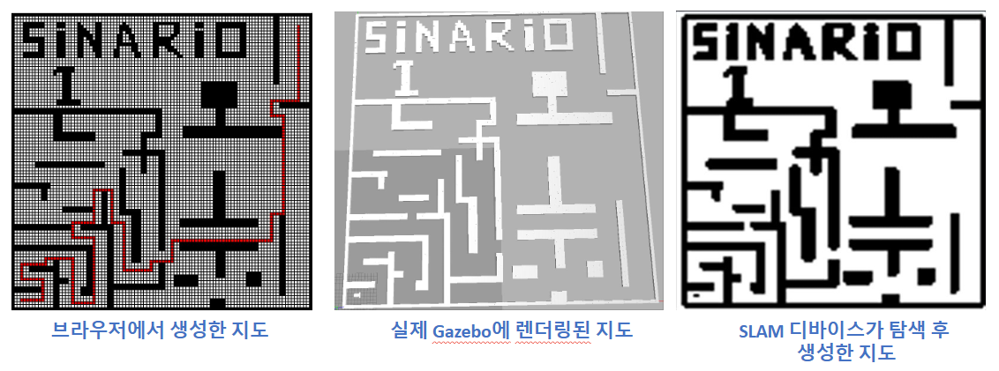
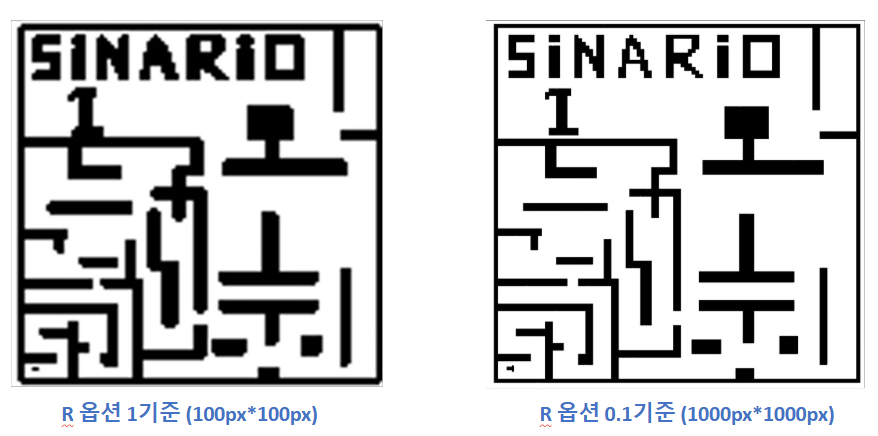
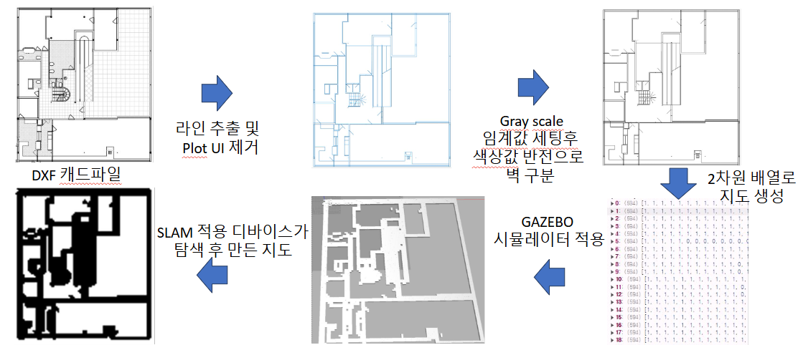
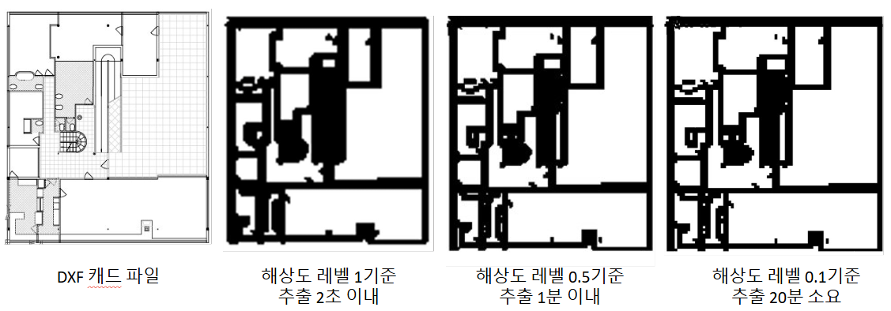

# 지도 다루기 (w/ SLAM)
{: .no_toc }

앞 글에서 브라우저로 맵을 그리는 것까지는 했는데, 그건 어디까지나 내 화면 안의 격자였다.
ROS가 실제로 읽는 지도는 형식이 따로 있다. 이번엔 그 포맷을 맞추고,
나중엔 캐드 도면까지 밀어 넣어 본 이야기다.

  
목차

  {: .text-delta }
- TOC
{:toc}

---

## SLAM?

*내가 지금 지도 어디에 있고 어디를 보고 있는지를 동시에 푸는 문제*

쉽게 말해 SLAM을 이용하면 내가 지도상의 어느 위치에 어디를 바라보고 있는지를 알 수 있다.

갈 수 있는 곳과 없는 곳을 인지하고 장애물의 위치를 조기에 파악해 안정적인 환경을
만드는 데 큰 역할을 한다.

SLAM에 관한 건 여기까지만 이야기하고, 이제 SLAM을 위해선 정확한 지도가 필요하다.

## 지도 추출

우린 지금까지 가상 환경(Gazebo)에서 진행했지만, ROS에서 실제로 인식하는 맵 파일은
**yaml 파일과 pgm 파일의 조합**이다.

pgm이 흑백 이미지로 벽과 빈 공간을 담고, yaml에는 그 이미지에 대한 메타 정보가 들어 있다.

| yaml 항목 | 의미 |
|:--|:--|
| `origin` | 지도 원점의 실제 좌표 |
| `resolution` | 픽셀 하나가 실제로 몇 m인지 |
| `occupied_thresh` / `free_thresh` | 그레이스케일 임계값. 어느 밝기부터 벽으로 볼지 |
| `negate` | 흑백 반전 여부 |

이 중 `resolution`이 뒤에서 계속 발목을 잡는다.

Gazebo에서 값을 추출하는 패키지는 많이 돌아다닌다. 아래 패키지를 참고했다.

[ROS2 GAZEBO WORLD GENERATOR 2D/3D](https://medium.com/@arshad.mehmood/ros2-gazebo-world-map-generator-a103b510a7e5)

*world 파일을 넣으면 pgm/yaml 쌍이 나온다*

이제 한 번에 프론트에서 연계해 실제 ROS에서 운영되는 지도 생성까지 가능해졌다.

*왼쪽부터 브라우저에서 그린 지도 → Gazebo에 렌더링된 지도 → SLAM 디바이스가 직접 돌아다니며 만든 지도*

세 장이 거의 같은 모양으로 나온 순간이 이 작업에서 제일 기분 좋았다.
내가 마우스로 칠한 격자가 시뮬레이터를 거쳐 로봇의 눈에 똑같이 들어왔다는 뜻이니까.

## 문제 - 해상도를 올리면 글자가 뭉갠다

{: .problem }
> **증상** 기본 해상도(`R` 옵션 1)로 뽑으면 100px × 100px짜리 지도가 나온다.
> 큰 벽은 멀쩡한데 좁은 통로나 세밀한 구조가 픽셀 단위로 뭉개져서 사라진다.

원인은 단순하다. 격자 한 칸을 픽셀 하나에 우겨넣으니 그보다 얇은 건 표현할 방법이 없다.

{: .solution }
> **해결** `R` 옵션을 0.1로 낮춰 픽셀당 실제 거리를 1/10로 잡았다.
> 같은 공간이 1000px × 1000px로 떨어지면서 세부 구조가 살아났다.

*왼쪽 R=1 (100px × 100px), 오른쪽 R=0.1 (1000px × 1000px)*

| R 옵션 | 출력 크기 | 픽셀 수 |
|:--|:--|--:|
| 1 | 100 × 100 px | 10,000 |
| 0.1 | 1,000 × 1,000 px | 1,000,000 |

픽셀 수가 100배가 됐으니 당연히 공짜는 아니었다. 이 대가는 캐드 파일에서 제대로 드러난다.

## 캐드 도면에서 지도 뽑기

현장 도면이 이미 DXF로 있는데 굳이 손으로 다시 그릴 이유가 없다. 그래서 캐드 파일도
같은 파이프라인에 태워봤다.

*DXF → 라인 추출 및 Plot UI 제거 → 그레이스케일 임계값 후 반전으로 벽 구분 → 2차원 배열 → Gazebo → SLAM 탐색*

도면에는 치수선, 해치, 도면틀 같은 로봇에게 필요 없는 것들이 잔뜩 들어 있다.
라인만 추출해서 UI 요소를 걷어내고, 그레이스케일 임계값으로 벽만 남긴 뒤 반전시켜
2차원 배열로 바꿨다.

### 그리고 20분을 기다렸다

해상도 레벨을 낮출수록 추출 시간이 눈에 띄게 늘었다. 같은 DXF 한 장을 기준으로 재봤다.

| 해상도 레벨 | 추출 소요 시간 | 결과 |
|:--|--:|:--|
| 1 | **2초** 이내 | 큰 벽만 남고 세부 구조 소실 |
| 0.5 | **1분** 이내 | 실용적인 절충점 |
| 0.1 | **20분** 소요 | 도면에 가장 근접 |

*왼쪽부터 원본 DXF, 레벨 1(2초), 레벨 0.5(1분), 레벨 0.1(20분)*

레벨 1에서 0.5로 갈 때는 몇 초에서 1분 남짓이라 참을 만한데,
0.5에서 0.1로 한 단계 더 내리는 순간 20배가 뛴다.
눈으로 보이는 품질 차이는 그만큼 크지 않았다.

{: .note }
> 결국 현장에서는 **0.5**를 기본값으로 썼다. 1분이면 커피 타 올 시간이고,
> 로봇이 주행하는 데 필요한 정밀도는 충분히 나온다.

## 마치며

지도 하나 만드는 데 이렇게 많은 선택지가 있을 줄 몰랐다.
해상도를 올리면 정확해지지만 시간과 메모리를 먹고, 낮추면 좁은 통로가 통째로 사라진다.
"정확한 지도"가 아니라 "이 로봇에게 충분한 지도"를 찾는 게 일이었다.

브라우저에서 그린 격자가 SLAM 결과물과 겹쳐 보였을 때가 제일 재미있었다.
시뮬레이션이 현실을 얼마나 흉내 낼 수 있는지 처음으로 감이 왔다.

<!-- TODO(수치): 0.5 레벨로 뽑은 pgm 파일 용량과 SLAM 로딩 시간을 재서 추가하기 -->

다음엔 이런 걸 해보면 좋겠다.

- **DXF 레이어 기반 필터링** — 지금은 이미지를 임계값으로 자르는데, 캐드 레이어 정보를 그대로 읽으면 치수선 제거를 훨씬 정확하게 할 수 있을 것 같다.
- **추출 속도 개선** — 20분짜리 레벨 0.1을 병렬 처리로 얼마나 줄일 수 있는지 재보고 싶다.
- **실측 지도와 도면 지도 겹쳐보기** — 도면대로 지어진 건물은 없다. 로봇이 SLAM으로 만든 지도와 DXF를 겹쳐서 오차가 몇 cm인지 확인해보고 싶다.
