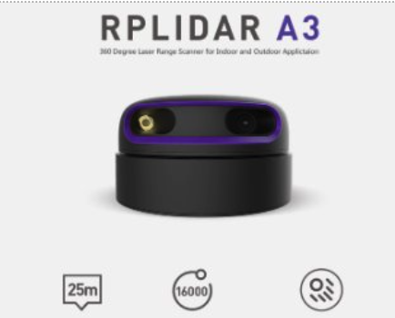
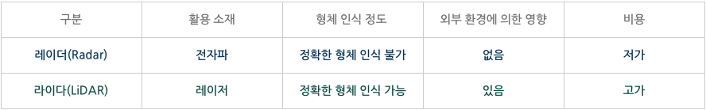
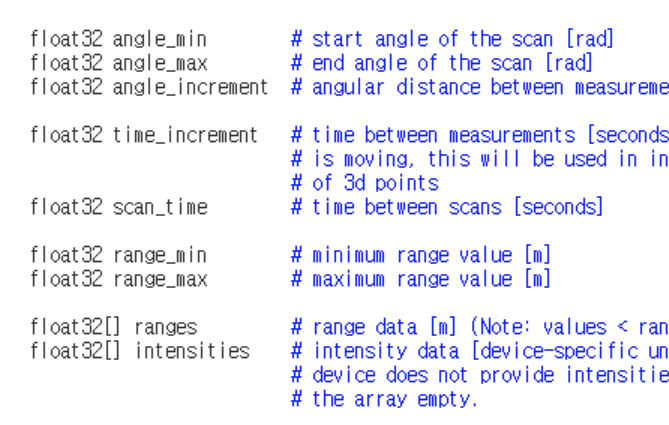
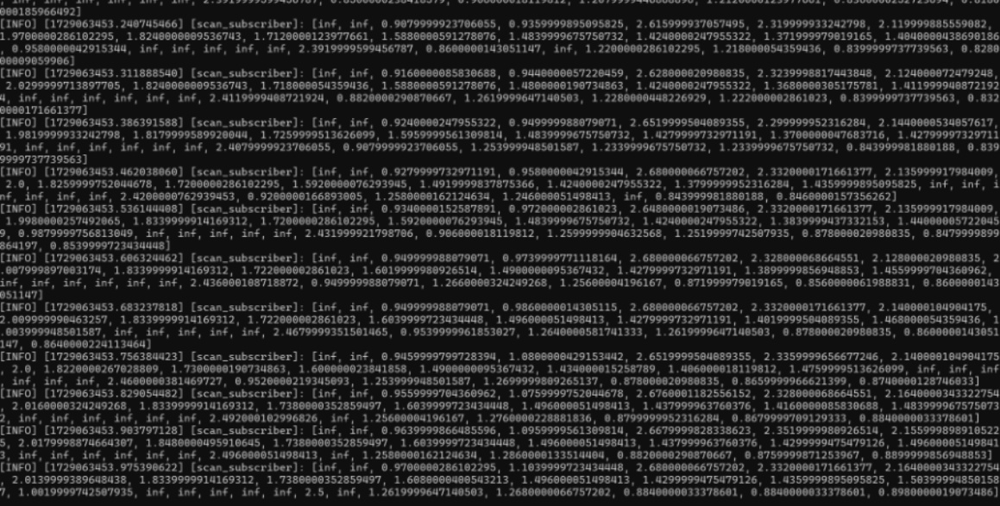
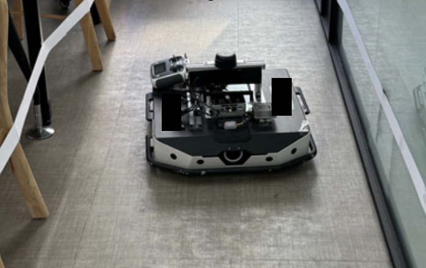
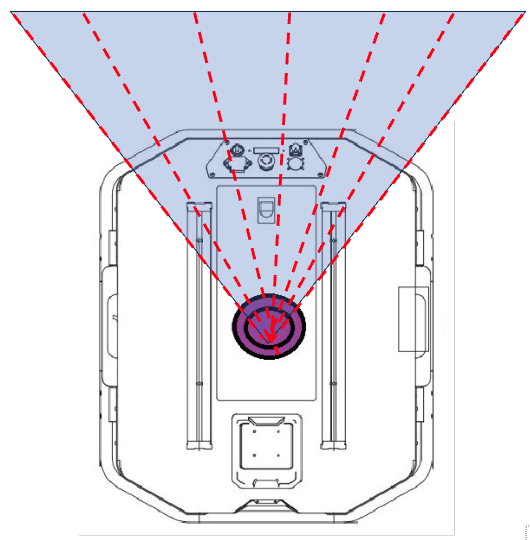
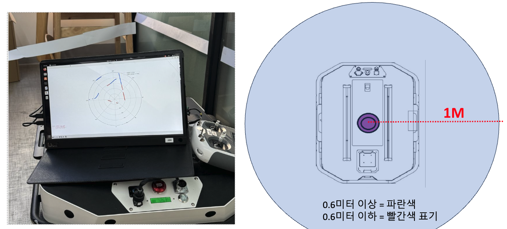
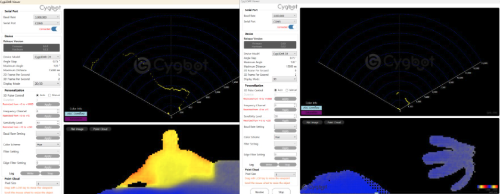

# Lidar를 이용한 측위
{: .no_toc }

시뮬레이터 안에서는 벽이 어디 있는지 프로그램이 이미 알고 있다. 그런데 실제 로봇은
아무것도 모른 채 놓인다. 그래서 눈을 달아줘야 했다. 라이다 이야기다.

  
목차

  {: .text-delta }
- TOC
{:toc}

---

## 로봇의 또 하나의 눈

*빛을 쏘고 돌아오는 시간으로 거리를 잰다*

레이더(Radar)라는 말은 많이 들어봤어도, 두 단어가 동시에 사용되기 전까진
라이다(Lidar)라는 말은 사투리인 줄 알았다.

요약하자면 레이더는 **전파**가 반사되어 돌아오는 시간으로 거리를 계산하고,
라이다는 **빛**이 반사되어 돌아오는 시간으로 거리를 측정한다. 원리는 닮았는데
쓰는 매체가 다르다.

*전파냐 빛이냐의 차이가 형체 인식 정밀도와 가격을 가른다*

| 구분 | 레이더(Radar) | 라이다(LiDAR) |
|:--|:--|:--|
| 활용 소재 | 전자파 | 레이저 |
| 형체 인식 | 정확한 형체 인식 불가 | 정확한 형체 인식 가능 |
| 외부 환경 영향 | 없음 | 있음 |
| 비용 | 저가 | 고가 |

표에서 대수롭지 않게 넘겼던 "외부 환경에 의한 영향 - 있음", 이 한 줄이
나중에 나를 제대로 물어뜯게 된다.

## RPLIDAR A3

실제 사용할 라이다 모델이다.

| 항목 | 설정값 |
|:--|--:|
| 측정 각도 | 360° |
| 스캔 주기 | 10 Hz (초당 10회전) |
| 1회전당 샘플 수 | 1,800개 |
| 각도 분해능 | **0.2°** |
| 유효 측정 거리 | 0.3 m ~ 25 m |

초당 10회 돌면서 토픽을 발행하고 한 바퀴를 1,800개로 쪼개 수집하니,
**0.2도 간격**으로 훑는다고 보면 된다.

*데이터시트에 나온 대로 angle_min/max, ranges, intensities가 들어온다*

데이터시트를 보면 이런 식의 값을 준다고 나와 있으니 맞춰서 대응하면 되고,
실제로도 아래처럼 배열로 값을 제공한다. 물론 배열 길이는 위에서 말한 대로 1,800개다.

*중간중간 inf가 섞여 들어온다*

`infinity` 값이 중간중간 보인다. 스펙상 거리가 너무 가깝거나(0.3 m 미만) 너무 먼 경우
(25 m 초과) `inf`를 반환한다.

같이 들어오는 `intensities`는 빛이 물체에 부딪혀 돌아온 세기다. 물체(Mesh)마다
반사되어 돌아오는 값이 다를 테니, 그 값으로 어떤 물체가 있는지 살짝이나마 유추할 수 있다.
자동차의 차선 보조장치 같은 느낌이랄까.

## 유리를 장애물로 못 잡는다

알고는 있었지만 평소엔 생각지 않던 부분인데, 빛이 유리를 그냥 통과해버려서
유리를 장애물로 감지하지 못하는 이슈가 발생했다. 로봇 입장에서는 그냥 뻥 뚫린 길이다.

{: .problem }
> 앞의 비교표에 적혀 있던 "외부 환경에 의한 영향 - 있음"이 결국 이거였다.
> 레이저 기반이라는 건 빛이 통과하는 건 못 본다는 뜻이기도 하다. 좋은 모델은 또 모르겠다.

이번에 쓴 라이다는 단일 채널이라 딱 그 높이의 단면만 본다. 그래서 테스트할 때도
라이다 높이에 맞춰 장애물을 세워두고 진행했다.

*오른쪽이 유리 파티션. 라이다한테는 존재하지 않는 벽이다*

## 전방 화각으로 장애물 회피하기

거리가 잘 들어오는 걸 확인했으니 이제 써먹을 차례다.
전면부의 특정 화각 몇 개를 선점해두고, **50 cm 이하**로 장애물이 탐지되면
회피해서 움직이도록 작업했다.

*전면을 부채꼴로 나눠 감시한다*

## 눈에 보이게 만들기

숫자만 봐서는 로봇이 뭘 보고 있는지 도무지 감이 안 온다.
그래서 거리별로 색을 다르게 주고 Plot을 띄워봤다.

*0.6 m 이상은 파란색, 0.6 m 이하는 빨간색으로 표시했다*

| 색상 | 거리 |
|:--|:--|
| 파란색 | 0.6 m 초과 |
| 빨간색 | 0.6 m 이하 |

회피 동작 자체는 50 cm를 기준으로 도는데, 시각화는 0.6 m부터 색을 바꿔서
가까워지고 있다는 걸 먼저 알아챌 수 있게 했다.

## 3D 라이다는 또 다른 세계

*채널이 많으면 이렇게 손 모양까지 포인트클라우드로 잡힌다*

이런 채널이 많은 3D 라이다를 이용하면 훨씬 다양하게 응용할 수 있다.
앞에서 말했듯 단일 채널은 딱 그 높이의 단면만 보기 때문에, 높이가 다른 장애물은
통째로 놓칠 수밖에 없다.

## 마치며

센서 데이터를 처음 받아봤을 때는 배열 1,800칸이 그냥 숫자 더미로만 보였는데,
Plot을 띄우고 색을 입히니 그제야 "아, 로봇이 이걸 보고 있구나" 싶었다.
눈에 보이게 만드는 작업이 기능 하나 더 만드는 것보다 값어치가 있을 때도 있는 것 같다.

그래도 제일 인상 깊었던 건 역시 유리다. 스펙 표에 "외부 환경에 의한 영향: 있음"이라고
한 줄 적혀 있던 게, 현장에서는 "벽이 없는 것으로 보인다"로 나타났다.
데이터시트를 읽는 것과 이해하는 건 확실히 다른 일이었다.

<!-- TODO(수치): 회피 동작이 트리거되고 실제로 멈추기까지의 지연 시간(ms) 측정해서 추가 -->

다음엔 이런 걸 해보면 좋겠다.

- **intensities 값으로 재질 구분** — 유리와 벽의 반사 강도가 다르다면, 거리(inf)가 아니라 세기로 유리를 잡아낼 수 있을지 실험해보고 싶다.
- **초음파 센서와 퓨전** — 초음파는 유리를 잘 잡는다. 라이다가 못 보는 구간만 초음파로 메우면 어떨지.
- **다채널 3D 라이다** — 단일 채널의 "그 높이만 본다" 문제를 해결할 유일한 방법 같다.
