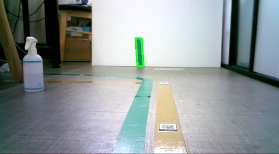
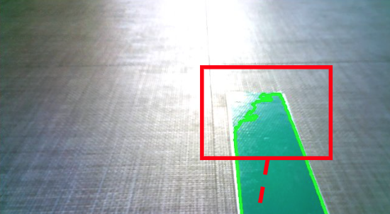
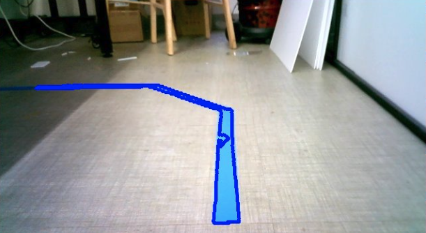
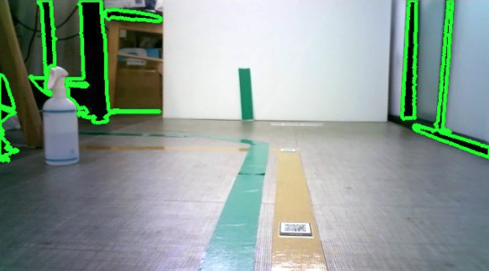

# 카메라 센서를 이용한 라인 트레이싱
{: .no_toc }

라이다로 장애물은 피하게 됐는데, 이번엔 정해진 선을 정밀하게 따라가야 하는 요구가 들어왔다.
AGV처럼 움직여야 한다는 얘기다. 마침 카메라가 달려 있으니 그걸로 해보기로 했는데,
결론부터 말하면 절반만 성공했다.

  
목차

  {: .text-delta }
- TOC
{:toc}

---

## 로봇의 또 하나의 눈 (2)

특정 조건 때문에 정밀하게 라인을 따라 AGV처럼 움직여야 하는 케이스가 생겼다.

마그네틱 센서를 쓰면 상황에 따라 더 정밀하게 가능하겠지만, 그러려면 바닥 공사가 따라온다.
그래서 우선은 이미 부착되어 있는 카메라 센서를 써보기로 했다.

## 접근 방법

바닥에 색 테이프를 붙이고, 카메라가 그 색만 골라내게 하는 단순한 방식이다.

| 단계 | 처리 |
|:--|:--|
| 1 | OpenCV로 카메라 프레임 실시간 캡처 |
| 2 | 색상 임계값을 초록색 계열로 지정 |
| 3 | 임계값을 통과한 영역의 테두리 생성 |
| 4 | 이 영역이 화면 중앙이면 전진, 좌/우로 치우치면 각속도를 함께 실어 회전 |

색은 실내에서 비교적 사용 빈도가 낮은 **초록색** 테이프를 구매해서 썼다.
바닥이나 벽에 흔한 색을 고르면 그 색이 죄다 라인으로 잡히기 때문이다.

*초록 계열로 임계값을 잡고 테두리를 그려봤다*

여기까지는 잘 됐다. 문제는 조명이었다.

## 빛이 닿은 구간이 통째로 사라진다

실외는 당연히 힘들 거라 생각했는데, 실내에서도 조도에 따라 밝아진 부분은 감지가 안 된다.
창가나 조명 바로 아래를 지날 때 테이프가 하얗게 날아가면서 테두리가 그 지점에서 끊긴다.

*빨간 사각형 안이 조명에 날아간 구간. 초록 테두리가 여기서 뚝 끊긴다*

색상 임계값 방식의 근본적인 한계다. 밝기가 확 올라가면 같은 테이프라도
지정해둔 색 범위를 벗어나버리고, 그렇다고 범위를 넓히면 이번엔 엉뚱한 것까지 잡힌다.

## 색을 바꿔도 크게 나아지지 않았다

혹시 색 문제인가 싶어 파란색으로도 시도해봤다.

*파란색은 배경과 덜 섞이긴 했다*

이처럼 파란색으로 비교적 사용 빈도가 낮은 색상을 쓰면 일부 개선되긴 하는데,
크게 의미 있진 않을 듯하다. 조도가 문제지 색이 문제가 아니었으니까.

## 검정 임계값은 세상 전부를 잡는다

그럼 아예 어두운 색을 쓰면 어떨까 싶어 임계값을 검정 계열로 잡아봤다.
결과는 더 심각했다. 전선, 책상 다리, 문틀, 그림자까지 전부 라인이 되어버렸다.

*어두운 건 전부 라인이다. 로봇 입장에선 사방이 길이다*

밝은 쪽으로 가면 날아가고, 어두운 쪽으로 가면 세상 모든 그림자가 딸려 온다.
색상 임계값 하나로 버틸 수 있는 폭이 생각보다 훨씬 좁았다.

## 정리

| 시도 | 결과 | 걸린 지점 |
|:--|:--|:--|
| 초록 테이프 | 균일한 조도에서는 동작 | 밝은 구간에서 소실 |
| 파란 테이프 | 배경 간섭은 줄어듦 | 조도 문제는 그대로 |
| 검정 계열 임계값 | 사실상 사용 불가 | 그림자·전선·가구가 전부 검출 |

<!-- TODO(수치): 조도(lux)별 라인 검출 성공률을 재서 표에 추가하면 좋겠다 -->

Vision 카메라로 물체 자체를 인식하는 게 아닌 이상, 카메라 센서는 다른 센서와
퓨전해서 써야겠다는 게 이번 결론이다.

## 마치며

"카메라 달려 있으니까 그걸로 하면 되지"라고 쉽게 생각했던 게 컸다.
색상 임계값은 조명이 통제된 환경에서만 성립하는 가정인데, 실제 사무실 바닥은
창가와 조명 아래와 그늘이 다 섞여 있다.

그래도 실패 과정이 명확했던 건 다행이었다. 밝으면 사라지고 어두우면 다 잡히니,
"단일 색상 임계값으로는 안 된다"는 결론까지 오래 걸리지 않았다.
안 되는 이유를 알고 접는 것도 나쁘지 않은 결과라고 생각한다.

다음엔 이런 걸 해보면 좋겠다.

- **적응형 임계값(adaptive threshold)** — 프레임 전체의 밝기 분포를 보고 임계값을 매번 다시 잡으면 조도 변화를 어느 정도 흡수할 수 있을 것 같다.
- **마그네틱 센서 병행** — 애초에 이쪽이 정답이었을지도 모른다. 바닥 공사 비용과 정밀도를 비교해보고 싶다.
- **라이다 + 카메라 퓨전** — 라이다로 대략의 위치를, 카메라로 미세 정렬을 담당하게 나누는 구조.
