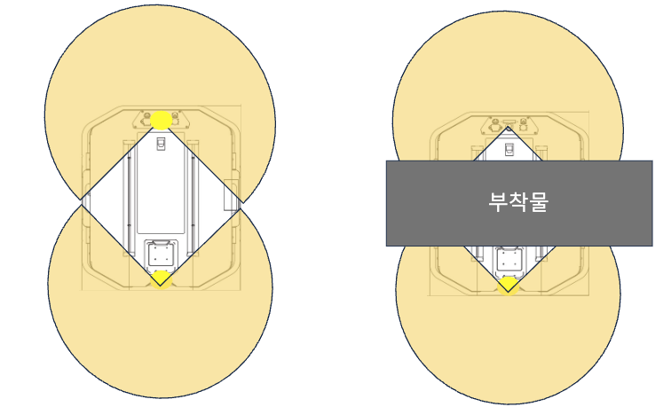
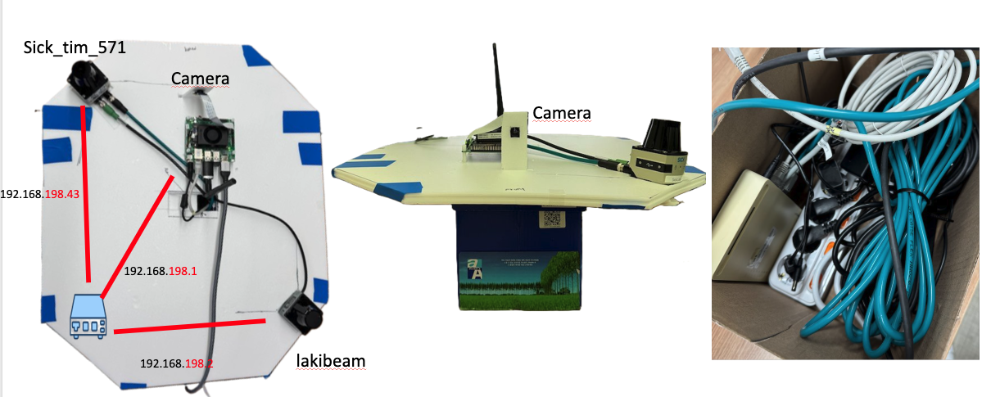
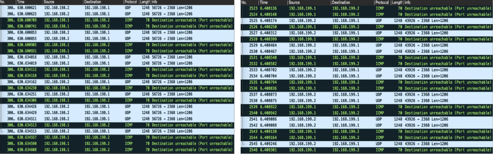
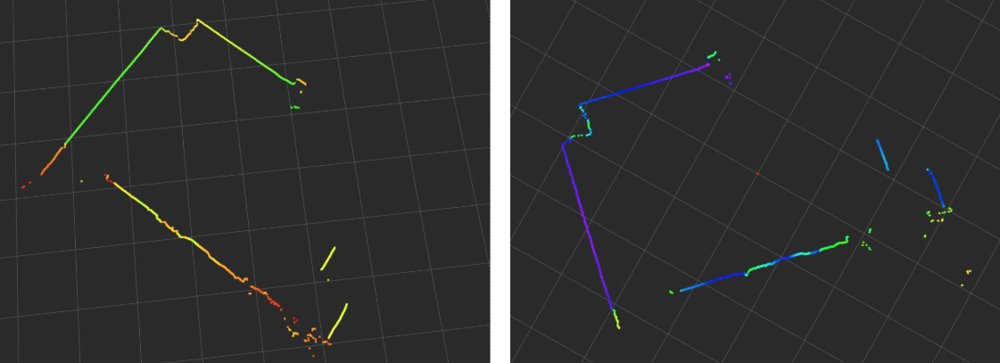
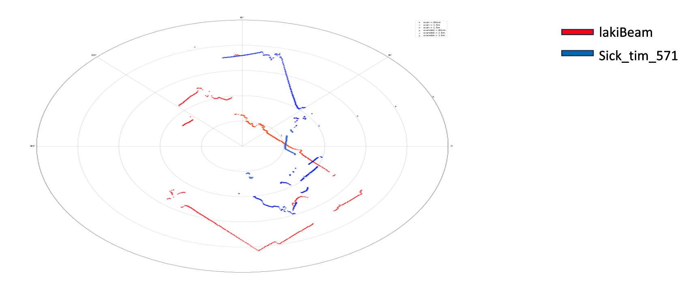
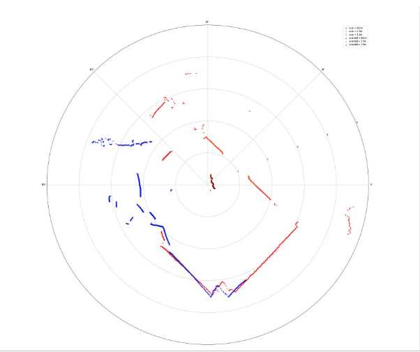

# 다중 라이다 시각화
{: .no_toc }

라이다가 한 대 더 생겼다. 두 대를 붙이면 사각지대가 줄어들 거라는 건 알겠는데,
어디에 어떻게 붙일지부터가 문제였다. 게다가 이번엔 소프트웨어보다
**전압과 랜선**에서 훨씬 오래 붙잡혀 있었다.

  
목차

  {: .text-delta }
- TOC
{:toc}

---

## 왜 대각선인가

처음엔 앞뒤로 배치할 생각이었다. 직관적이니까. 그런데 그리다 보니 문제가 보였다.

*앞뒤 배치(왼쪽)는 부착물 하나만 올라와도 커버리지가 통째로 잘린다(오른쪽)*

앞뒤로 배치하면 라이다 탐지 높이의 **내부 통로를 비워둬야** 하고,
중간에 부착물이 있으면 그대로 음영 구역이 생긴다.
로봇 위에 뭘 하나 올리는 순간 센서 반쪽이 무용지물이 되는 구조다.

대각선으로 배치하면 각 센서가 로봇 몸통 바깥쪽을 향하게 되어,
가운데 무엇이 올라오든 커버리지가 크게 상하지 않는다.

## 그런데 센서를 받고 나니 날선만 들어 있었다

여기서부터가 진짜였다.

{: .problem }
> **증상** 방구석에서 편하게 키보드만 뚱땅거리면서 USB로 딸깍만 했는데,
> 센서를 받고 나니 상자에 **날선**만 들어 있었다. 커넥터도, 어댑터도 없다.
> 데이터도 LAN으로 들어오는 특이한 구조였는데 매우 당황스러웠다. (그냥 인터넷용 아니었냐고..)

게다가 두 개의 라이다가 다른 회사 제품이라 두 번 일해야 했다.

| 항목 | 센서 A | 센서 B |
|:--|:--|:--|
| 모델 | SICK TiM571 | Lakibeam |
| 제조사 | 서로 다름 | 서로 다름 |
| 전원 | 12 V | 12 V |
| 데이터 인터페이스 | Ethernet (UDP) | Ethernet (UDP) |
| 설정 방식 | 제조사별 상이 | 제조사별 상이 |

{: .solution }
> **해결** 어찌어찌 정격 전압에 맞춰 **젯슨 어댑터를 가져와 잘라주고 합선시켜 12 V**로
> 맞춰줬다. 그리고 매뉴얼에 나온 대로 IP 세팅 과정을 진행하니 라이다 데이터가
> 수신되어 신기했다.

전원 어댑터를 자르고 있는 나를 보면서 "이게 소프트웨어 개발인가" 싶었지만,
데이터가 들어오는 순간은 확실히 짜릿했다.

## 내부 네트워크 구성

최종적인 내부 네트워크 구성은 아래와 같다.

*스위치를 게이트웨이(.1)로 두고 라이다 두 대와 카메라를 같은 사설 대역에 물렸다*

| 장치 | IP |
|:--|:--|
| 내부 스위치 / 제어 PC | 192.168.198.1 |
| Lakibeam | 192.168.198.2 |
| SICK TiM571 | 192.168.198.43 |

## 문제 - 라이다 IP를 까먹었다

{: .problem }
> **증상** 센서 자체에 설정해둔 IP를 까먹었다. 매뉴얼 기본값으로도 안 붙고,
> 장비에 라벨도 없다. 데이터는 분명 나오고 있을 텐데 어디로 쏘는지를 모른다.

{: .solution }
> **해결** 와이어샤크를 켜고 노가다로 찾았다. 라이다는 전원만 들어오면 설정된
> 목적지로 UDP를 계속 쏘기 때문에, 패킷의 **Source 주소**만 보면 답이 나온다.

*192.168.198.2 → 192.168.198.1 로 Len 1206짜리 UDP가 계속 날아온다. 받는 쪽이 안 열려 있어서 ICMP Port unreachable이 같이 찍힌다*

| 관측 항목 | 값 |
|:--|:--|
| 프로토콜 | UDP |
| 페이로드 길이 | 1,206 bytes |
| 목적지 포트 | 2368 |
| 동반 응답 | ICMP Destination unreachable (Port unreachable) |

ICMP가 잔뜩 찍히는 건 라이다는 열심히 쏘는데 받을 프로세스가 없다는 뜻이다.
바꿔 말하면 **이 ICMP가 보인다는 것 자체가 센서는 살아 있다는 증거**였다.
IP를 찾는 동시에 센서 상태까지 확인한 셈이다.

## 각각 잘 들어오는지 확인

각 센서별로 수집된 포인트를 시각화하면 rviz에서 아래처럼 볼 수 있다.

*왼쪽과 오른쪽이 각각 다른 센서. 라이다 스펙이 270°인 걸 고려하면 얼추 잘 측정된다*

## 센서 퓨전

이제 센서 두 개를 합쳐 하나의 그림으로 나타내야 한다. **센서 퓨전**이라고 하겠다.

*빨강이 Lakibeam, 파랑이 SICK TiM571. 같은 공간을 보고 있는데 벽이 두 겹으로 보인다*

라이다 부착 위치와 방향이 다르다 보니 **offset과 rotation** 과정이 필요하다.

{: .solution }
> **해결** 두 라이다를 사선으로 배치했으니, 각 센서의 중심점 사이 거리를 실측해
> 그만큼 평행이동(offset)시키고, 부착 각도만큼 회전(rotation)시켜 하나의 좌표계로 옮겼다.

*두 겹으로 보이던 벽이 한 줄로 겹쳐졌다. 이제 사방이 한 장의 그림이다*

얼추 원하는 그림이 나왔다. 이제 1채널 한정이지만 **360도 탐지**가 가능하게 되었다.

| 항목 | 센서 1대 | 센서 2대 (퓨전 후) |
|:--|:--|:--|
| 커버리지 | 270° | **360°** |
| 사각지대 | 후방 90° | 부착물 그림자 정도 |
| 채널 | 1채널 | 1채널 (동일 높이) |

<!-- TODO(수치): 퓨전 후 두 센서가 겹치는 구간에서 같은 벽까지의 거리 오차(cm)를 재서 넣기 -->

## 마치며

이번 작업의 절반은 코드가 아니라 전선이었다. 정격 전압 맞추겠다고 어댑터를
자르고 있을 때는 내가 무슨 일을 하고 있나 싶었는데, 결국 그게 데이터가 들어오게 만든
결정적인 단계였다.

와이어샤크로 IP를 찾은 것도 기억에 남는다. 웹 개발할 때는 네트워크 탭만 열면
다 보였는데, 장비가 상대면 패킷을 직접 들여다보는 것 말고는 방법이 없더라.
평소 "알긴 아는" 도구가 진짜로 필요해지는 순간이 있다.

배치를 정할 때 그림부터 그려본 것도 잘한 선택이었다. 앞뒤로 그냥 붙였다면
로봇 위에 부착물 하나 올리는 순간 다시 뜯어야 했을 거다.

다음엔 이런 걸 해보면 좋겠다.

- **퓨전 정확도 정량화** — 지금은 "얼추 맞았다" 수준이다. 겹치는 구간의 거리 오차를 cm 단위로 재서 offset을 미세 조정하고 싶다.
- **TF 트리로 정리** — 지금은 직접 계산해서 좌표를 옮기고 있는데, ROS의 `tf2`로 관리하면 센서가 더 늘어나도 감당이 된다.
- **센서 상태 감시** — ICMP로 살아 있는 걸 우연히 확인했던 것처럼, 아예 패킷 수신 여부로 센서 헬스체크를 붙여두면 현장에서 편할 것 같다.
- **높이가 다른 3D 라이다 추가** — 1채널 두 대로는 여전히 "그 높이"만 본다.
