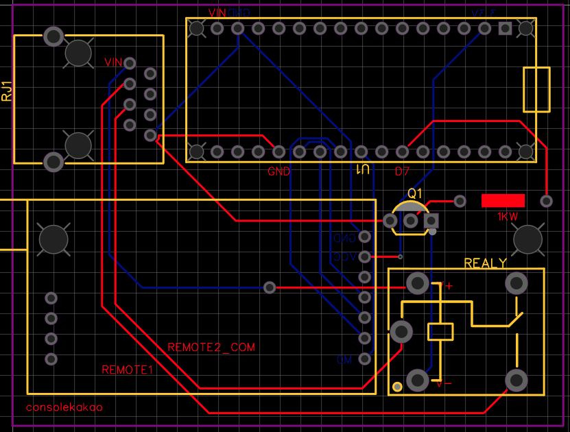
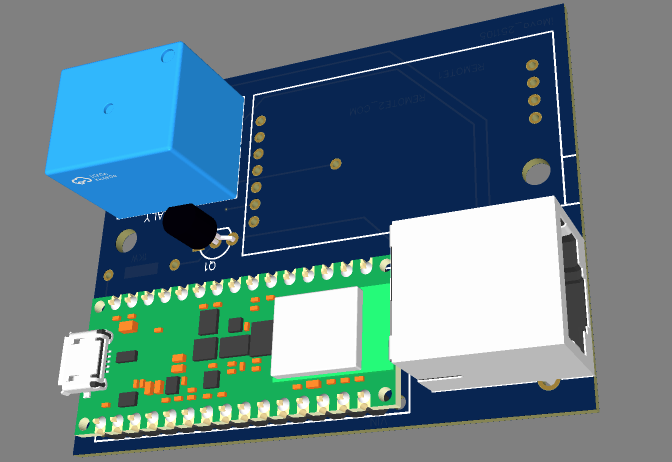
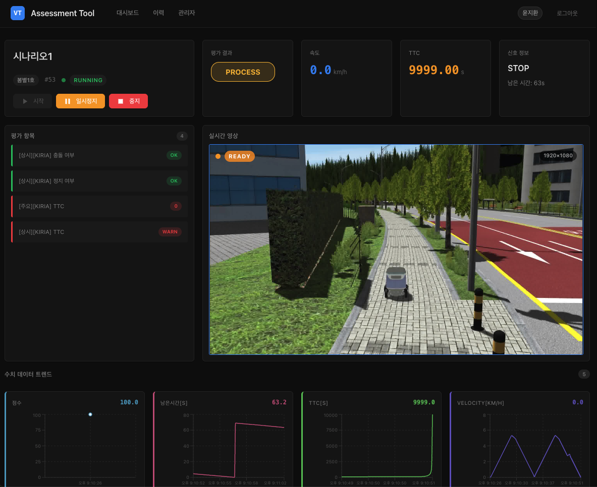

# 2025 회고
{: .no_toc }

{: .no_toc }

늦은 감이 있는 2025년 회고.

작년과 마찬가지로 많은 변화가 있었다.

AMR 로봇은 3대나 만들어졌고 자율주행부터 장애물 회피, 관제 시스템까지 얼추 갖추어졌고 로봇을 개발하는 인력이 충원되어서 직접적으로 하드웨어 로봇을 개발하는 시간은 많이 줄었다.

AMR로봇과 인터페이스를 설계하고 백엔드와 프론트엔드를 구성하던중 소프트웨어 개발자도 충원되었다.

무얼 했나 돌이켜보니 크게 아래와 같았다.

| 한 일 | 결과 |
|:--|:--|
| AMR 로봇 개발 | **3대** 제작. 자율주행 · 장애물 회피 · 관제까지 |
| PCB 회로 설계 | 인생 첫 기판. **4번 만에** 완성 |
| 평가툴 개발 | 외부 VTD 연동, 검증 보고서 자동 생성. 납품 완료 |
| 조직개편 | 파트 신설, 파트장 |
| 오토 트레이딩 외주 | OCR 기반 포지션 미러링. 완료 |

## PCB 회로구성 및 보드 제작

인생 첫 기판 설계이자 도전이었다.

지금 생각해보면 그리 어려운게 아니었는데 중국에 주문해서 배송까지 시간이 걸리고 모듈 납땜까지 해야 비로소 정상 작동 여부를 알 수 있기에
그런 부분에서 꽤나 마음졸이고 답답했던 거 같다.

내가 만든건 LORA 네트워크를 이용해 AMR 로봇을 원격 시동 할 수 있는 모듈이다. 3D와 회로 둘 다 경험이 없어 애를 먹었다.

결과적으론 4번만에 보드 제작에 완료했다. 랜선을 그냥 랜선으로 보지않고 8핀을 나눠서 전원도 랜선으로 공급해보는 신기한(?) 경험이었다.

이제 브라우저상의 관제 시스템에서 AMR로봇의 시동을 켜거나 끌 수 있다.

## 평가툴 개발

자율주행 로봇이 안전하게 잘 주행하는지 테스트하는 툴을 개발했다.

외부 VTD와 연동해 영상을 스트리밍하고 실시간으로 평가항목에 맞게 테스트하고 검증 보고서를 작성해주는 소프트웨어다.

무사히 잘 납품하고 넘어갔다.

*영상 스트리밍과 평가 항목 판정이 한 화면에서 돌아간다*

## 조직개편

팀원이 충원되고 파트가 생기면서 파트장 직책을 맡게되었다.

실무에서 매니징으로 넘어가는 중인데 앞으로 할 일이 많아지겠지만 그래도 지금 다들 열심히 해주어서 걱정은 적다.

## 오토 트레이딩 외주

코인 트레이더 유튜버의 생방송 이미지를 실시간으로 불러와 OCR 처리해서 포지션을 알아낸 후 따라가는 유저들의 포지션을 비율에 맞게 똑같이 세팅하는 프로그램을 개발했다.

트레이더가 비트코인을 10개샀다면 내가 10%로 설정한 경우 자동으로 1개를 구매하게된다.

롱 포지션과 숏 포지션으로 나뉘어있고 알트코인도 섞이고 순서도 섞여서 꽤나 고생했다.

이미지에서 추출해야하다보니 OCR 공부를 많이 하게되었는데 화질의 영향도 무시할 수 없어서 결국 구글 클라우드 OCR을 이용했다. (돈이 최고)

2.0000 BTC를 .을 못 찾아서 20000개를 구매하려고 하지않나.. 갑자기 방송이 가려져서 청산해버리지 않나 많은 우여곡절이 있었으나

무사히 완성했다. API 한 번에 수 억원이 흘러가는 아주 부담스러운 프로젝트였다.

## 마치며

작년이 "아무것도 모르는 상태로 뛰어든 해"였다면, 올해는 만든 것들이
실제로 굴러가기 시작한 해였다. AMR이 3대가 되고, 내가 그린 기판이 4번 만에
살아나고, 평가툴이 납품까지 갔다.

기억에 제일 남는 건 PCB다. 코드는 틀리면 바로 알 수 있는데, 기판은
중국에 주문해서 배송받고 납땜까지 끝내야 비로소 정상 작동 여부를 알 수 있었다.
그 기다리는 시간이 답답하면서도, 켜졌을 때의 기분은 소프트웨어에서 느껴본 적이 없는 거였다.

트레이딩 외주는 지금 생각해도 아찔하다. `2.0000 BTC`에서 소수점을 못 찾아
20,000개를 사려고 했던 그 순간이 아직도 생생하다. API 한 번에 수억이 흘러가는
프로젝트에서 파싱 실수 하나가 어떤 의미인지 몸으로 배웠다.

실무에서 매니징으로 넘어가는 중인데, 솔직히 코드를 덜 짜게 되는 게 아쉽기는 하다.
그래도 지금 다들 열심히 해주어서 걱정은 적다.

## 내년엔 이런 걸 해보고 싶다

- **만든 것들을 글로 남기기** — 작년 회고에도 "글로 작성해보려 한다"고 써두고 아직 안 쓴 게 많다. 올해는 진짜로.
- **PCB 한 번 더** — 4번 만에 성공한 건 운이 아니라 시행착오였다. 두 번째는 2번 안에 끝내보고 싶다.
- **매니징 공부** — 실무는 하던 대로 하면 되는데 이쪽은 아예 처음이다.
- **평가툴 고도화** — 납품하고 끝낼 게 아니라, 평가 항목을 설정으로 뺄 수 있게 만들면 재사용이 될 것 같다.
