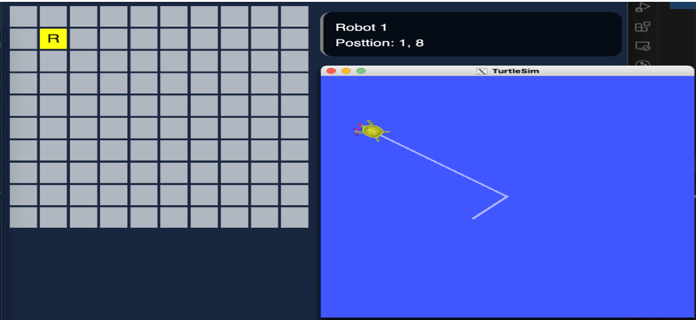

## 시작하기

조립피시조차 조립 못 하는 나에게 로봇개발이라는 업무가 주어졌다.

단순한 자료조사 수준으로 생각했는데 주 업무가 될지 몰랐다.

처음에 던져준 키워드는 ROS였다.

<br/><br/><br/>

Robot Operating System.

OS는 Linux Mac Windows만 생각했는데 이런놈은 또 처음 들어본다.

대충 로봇 개발을 위한 오픈소스 소프트웨어 플랫폼이란다.

서로 각각 개발했던 로봇 플랫폼을 하나로 통일해서 사용할 수 있게 해주는 플랫폼이라고 생각하면 된다.

다행이 OS 자체를 밀어버리고 설치할 필요는 없고 기존 OS에서 설치만 하면 되고 우분투 기반으로 되어있어 러닝커브는 비교적 낮았다.

처음 예제 찾아보는데 버전명부터 튜토리얼까지 죄다 거북이 뿐이라 거북이를 참 좋아하는 사람들이구나 느꼈다.
(진심이었다. 새로운 버전 출시는 5월 23일 세계 거북이의 날에 나온다.)

<br/><br/><br/>

당시 Docker 옹호론자였던 나는 따로 OS를 설치하기도 귀찮고 배포문제를 염두해 Docker로 컨테이너를 띄워 작업했다.

오픈로보틱스에서 만들어둔 이미지(osrf/ros:humble-desktop-full)로 기본 튜토리얼을 실행하는데는 문제가 없었다.

버전은 EOL과 점유율을 생각해서 humble로 설치했다.

토픽이라는걸 발행하는쪽과 구독하는쪽 두 영역으로 나뉘어 있는데 이런 통신 방법을 통해 데이터를 주고받는다.

<br/><br/>

## 실습

튜토리얼에선 Talker와 Listener가 있는데 이걸 두 컨테이너로 띄워 통신하는 예제였다.

얼추 여기까지 진행했으면 ROS 세팅은 끝났다 생각하고 GUI에서 turtlebot(거북이 참 좋아한다.)

패키지를 설치하고 튜토리얼을 실행했다.


거북이가 잘 나오고 잘 돌아다닌다.

거북이를 보여주기위해 실행해야하는 패키지와 거북이를 움직이게하는 패키지를 따로 실행해야해서

작업하다보면 터미널이 참 많이 필요하다.

<br/><br/><br/>

앞서 말한 거북이를 움직이게 하는 패키지는 어떻게 토픽을 발행하는지 확인해보니 아래와 같은 토픽을 발행하고있었다.
<br/><br/>


<br/><br/>

직선속도와 각속도를 토픽으로 발행하면 해당 시간만큼 거북이가 움직이는 것을 확인할 수 있다.

이제 거북이가 어떤 값을 입력받아 움직이는지 확인했으니 외부에서 제어해보자.

생각한 프로세스는 아래와 같다.
<br/><br/>


<br/><br/><br/>

로직 개발이 완료되었으니 프론트 작업을 진행한다.

튜토리얼은 맵 크기가 10 x 10으로 고정되어있어 프론트에서도 10칸씩만 레이아웃을 구성했다.

<br/><br/><br/>



<br/><br/>

좌표값을 통해 단순계산으로 한 칸씩 직선으로 옮기는건 간단하지만 최단경로로 가야하기 때문에 대각선으로도 이동할 수 있어야한다.

theta값을 통해 목적지까지의 회전각을 구하고 해당 시간만큼 거북이를 회전시키는 로직을 구현 후 직선방향으로 이동되도록 구현했다.

<br/><br/>

```javascript
const getAngle = (x1: number, y1: number, x2: number, y2: number) => {
  return Math.atan2(y2 - y1, x2 - x1);
};

const distance = Math.sqrt(
  (currentX - targetX) ** 2 + (currentY - targetY) ** 2
);

const angle = getAngle(currentX, currentY, targetX, targetY);
console.log("Target Angle", angle);

let result = normalizeAngle(angle - position.head);
console.log("Change Angle", result);
```

토픽 발행을 바로 발행하면 좋겠지만 rclpy 라이브러리를 사용해야하는데, 이걸 사용하려면 또 파이썬 코드를 작성해야한다.

js로도 라이브러리가 있긴하지만 ROS2가 설치되어있어야하고 버전도 맞아야하는 등 여러 문제가 있어 우선 직접 excute하는 방식을 선택했다.

이로써 Front에서 GUI로 거북이의 목적지를 설정하면 실제 ROS 환경에서 거북이가 움직이는 것을 확인할 수 있었다.

<br/><br/><br/>

## Gazebo

가제보는 로봇 시뮬레이션 프로그램이라고 생각하면 편하다.

기존 turtlesim에서는 2D 거북이만 보였지만 이제 3D환경에서 다양한 오브젝트를 두고 거북이 말고 다른 모양으로 로봇을 커스텀해서 시뮬레이션을 해볼 수 있다.

블로그대로 설치하고 튜토리얼을 실행하면 아래와 같은 화면을 볼 수 있다.


<br/><br/>

맵을 하나씩 만들고 해야하는데 오브젝트 두기 귀찮으니 이것도 프론트에서 마우스를 이용해 그리드를 그려서 장애물로 만들게 진행하자.

생각한 로직은 아래와 같다.


이렇게 GUI 환경에서 사용자가 맵을 생성할 수 있게 되었다.

이제 BFS 탐색을 통해 최단 경로 계획을 세워보자.


BFS 탐색을 통해 로봇의 크기를 고려해 지나갈 수 있는 곳을 기준으로 경로 플랜을 작성하도록 기능을 추가해보았다.


로봇을 3*3 크기로 잡고 테스트결과 2칸의 공간은 경로계획에 넣지 않았다.