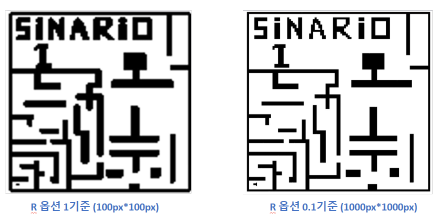

## SLAM?

 
쉽게말해 SLAM을 이용하면 내가 지도상의 어느 위치에 어디를 바라보고 있는지를 알 수 있는 방식이다.

갈 수 있는 곳과 없는곳을 인지하고 장애물의 위치를 조기인지해 안정적인 환경을 만드는데 큰 역할을 한다.

SLAM에 관한건 여기까지만 이야기하고 이제 SLAM을 위해선 정확한 지도가 필요하다.

   

## 지도 추출

우린 지금까지 가상의 환경(GAZEBO)에서 진행했지만 이제 ROS에서 실제로 인식하는 맵 파일은 yaml파일과 pgm 파일의 조합이다.

yaml 파일에는 pgm파일에 대한 정보가 들어있다.

원점의 좌표, 픽셀당 실제 거리, 그레이스케일 임계값 등을 포함하고 있다.

  
GAZEBO에서 값을 추출하는 패키지는 많이 돌아다닌다.

아래 패키지를 참고했다. 

[ROS2 GAZEBO WORLD GENERATOR 2D/3D](https://medium.com/@arshad.mehmood/ros2-gazebo-world-map-generator-a103b510a7e5)

   

이제 한 번에 프론트에서 연계해 실제 ROS에서 운영되는 지도 생성까지 가능하다.

 

  

해상도 조절을 통해 시간을 투자하면 좀 더 높은 퀄리티의 지도를 생성 할 수 있다.
 

  
캐드파일역시 가져와서 얼추 추출은 가능해졌다.

 

