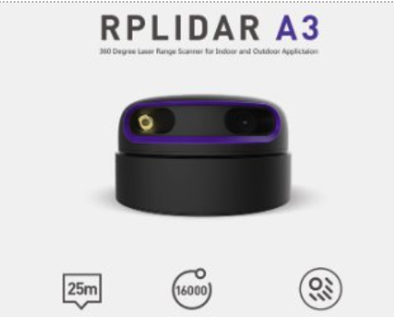
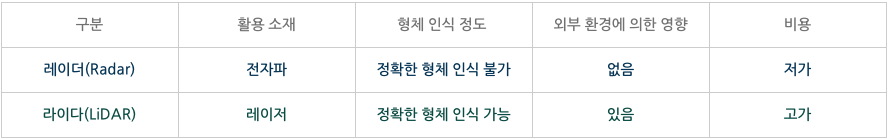
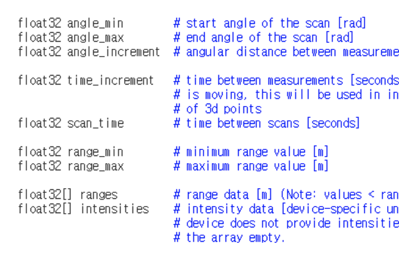
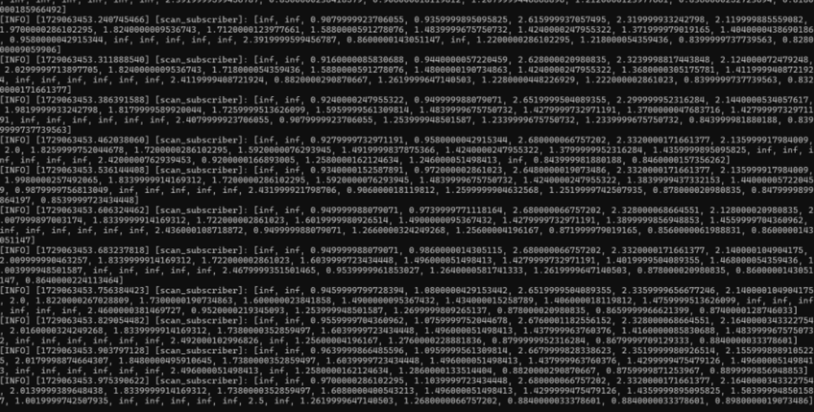
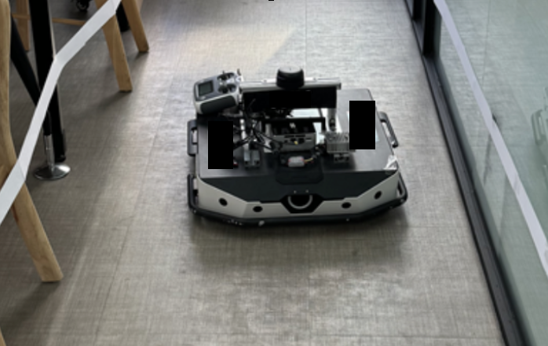
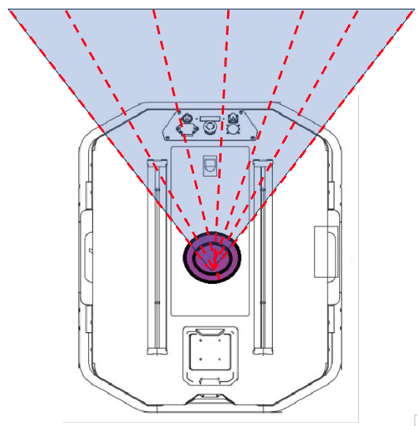
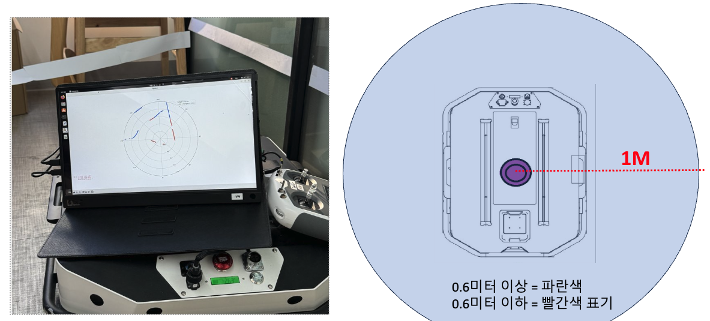

## 로봇의 또하나의 눈

    

 
레이더(Radar)라는 말은 많이 들어봤어도 두 단어가 동시에 사용되기 전까진 라이다(Lidar) 라는 말은 사투리인줄 알았다. 

요약하자면 레이더는 전파를 통해 반사되어 돌아오는 시간으로 물체와의 거리를 계산하고

라이다는 빛을 이용해 반사되어 돌아오는 시간을 계산해서 물체와의 거리를 측정한다.

두 장단점은 아래 표를 참고하자.

   

## RPLIDAR A3
  
실제 사용할 Lidar모델이다.

설정한 스펙은 360도로 초당 10회 돌면서 Topic을 발행한다.

토픽 발행시 1바퀴 돌때 1800번을 나눠서 정밀하게 수집하니 0.2도 간격으로 측정을 한다고 보면 된다.

데이터 시트를 보면 이런식의 값을 준다고 나와있으니 맞춰서 대응하고 실제로 아래처럼 배열로 값을 제공한다. 

물론 배열의 길이는 위에서 말했듯 1800개다.

infinity 값이 중간중간 보이는데 데이터시트의 intensities 값을 제공한다고 되어있다.

여기서 intensities값은 빛이 물체를 통과한 정도를 의미하는데 물체(Mesh)마다 통과되어 돌아오는 값이 다를테니

그 값으로 어떤 물체가 있는지 살짝이나마 유추할 수 있다.

자동차의 차선 보조장치 같은 느낌이랄까.

거리가 너무 가깝거나 먼 경우 (스펙상 30cm 이하 또는 25m 이상) inf를 반환한다.

알고는 있었지만 평소에 생각치 안 한 부분인데 빛이 유리를 통과해버려서 유리를 장애물로 감지 못하는 이슈가 발생했다. (좋은 모델은 또 모르겠다.)

라이다가 단일 채널이기에 라이다 높이에 맞춰 장애물을 생성하고 테스트했다.
  

  

이제 거리가 감지되는걸 확인했으니 전면부의 특정 화각 몇가지를 선점에 50cm 이하의 거리로 장애물이 탐지되면 회피해서 움직이도록 작업했다.
  

  

거리별로 색상의 차이를 주고 Plot을 띄워 시각화.

  

  

이런 채널이 많은 3D 라이다를 이용하면 더 다양하게 응용 가능하다.