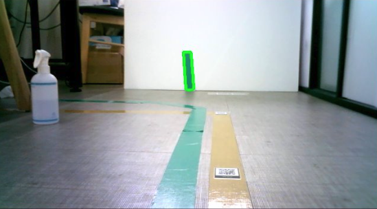
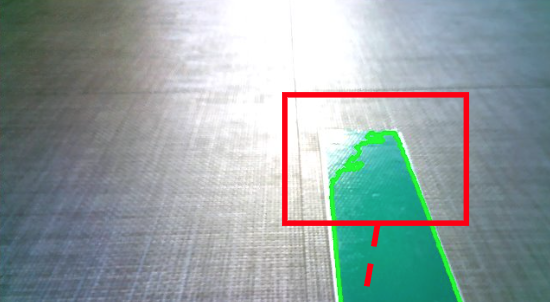
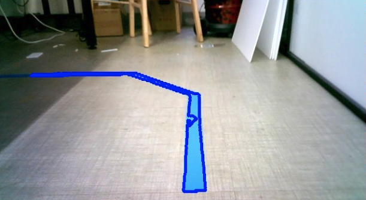
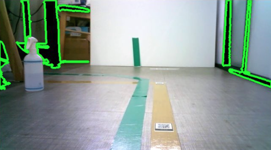

## 로봇의 또하나의 눈(2)

    

특정 조건으로 인해 정밀하게 라인을 따라 AGV 처럼 움직여야하는 케이스로 인해 

카메라 센서를 이용해 라인 트레이싱을 시도해보았다.

마그네틱 센서를 이용하면 상황에따라 더 정밀하게 가능하겠지만 

우선 부착된 카메라센서를 이용해보기로했다.

비교적 사용 빈도가 낮은 초록색 테이프를 구매후 

openCV를 이용해 이미지를 실시간 캡쳐 -> 색상 임계값을 초록색 계열로 지정후 테두리 생성

이 영역이 화면상 가운데 있다면 전진, 좌측이나 우측에 있다면 각속도도 함께 주어 해당 방향으로 돌도록 바퀴를 구동시켰다.

  

## 한계

  

실외에선 당연히 힘들겠지만 실내에서도 조도에따라 밝아진 부분은 감지가 불가능하다.

  

이처럼 파란색으로 비교적 사용 빈도가 낮은 색상을 이용하면 일부 개선되겠지만 크게 의미있진 않을 듯 하다.

  

  

임계값으로 검정색 계열을 잡으면 어두운 부분까지 잡히는 문제가 발생한다.

Vision카메라를 이용해 물체를 인식하지 않는 이상 카메라 센서는 다른 센서와 퓨전해서 사용해야겠다.

