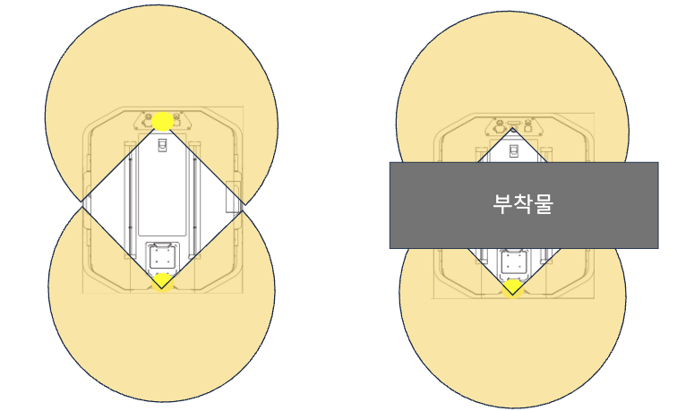
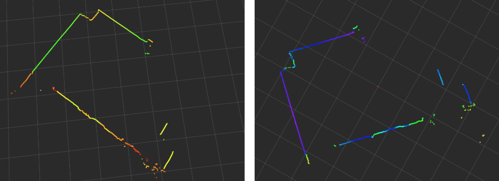
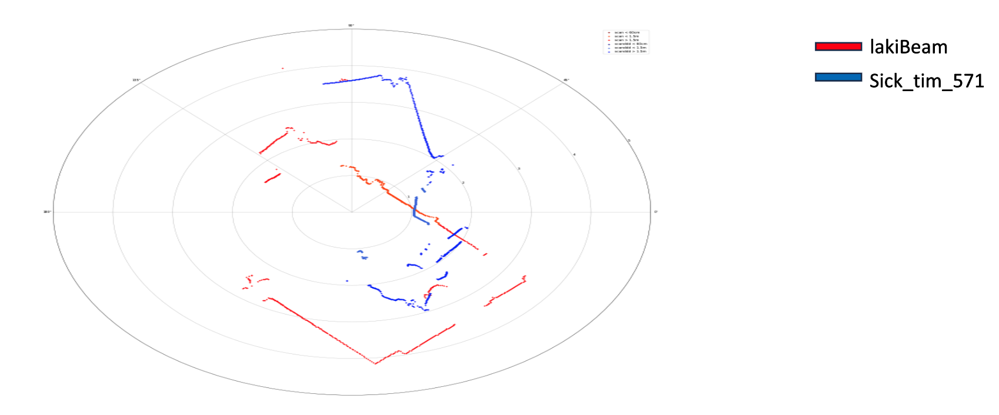
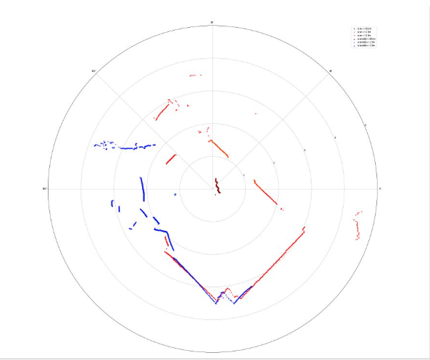
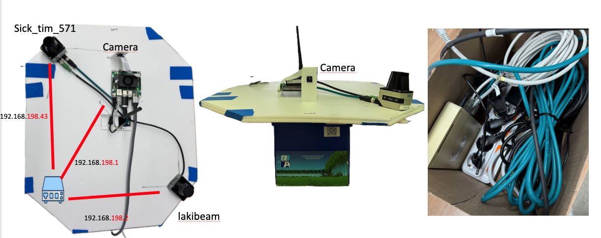

## 로봇의 또하나의 눈(3)

    

라이다가 하나 추가되어 라이다를 대각선으로 배치했다.

처음엔 앞뒤로 배치를 생각했지만 대각선으로 배치한 이유는 아래 그림과 같다.

  

  

앞 뒤로 배치시 라이다 탐지 높이의 내부 통로를 비워야하고 중간에 부착물이 있는 경우 음영 구역이 생긴다.

각각 센서별로 수집된 포인트들을 시각화하면 아래처럼 rviz에서 시각화가 가능하다.

  

  

라이다의 스펙이 270도인걸 고려하면 얼추 잘 측정된다는걸 알 수 있다.

이제 센서 두개를 합쳐 하나의 그림으로 나타내야한다. <b>센서퓨전</b>이라고 하겠다.

  

  

라이다 부착 위치와 방향이 다르다보니 offset과 rotation 과정이 필요하다.

두 개의 라이다를 사선으로 배치해서 중심점의 거리를 구한뒤 offset을 적용해주니 얼추 원하는 그림이 나왔다.

이제 1채널 한정이지만 360도 탐지가 가능하게 되었다.

  

## 처음겪었던 난관

  

방구석에서 편하게 키보드만 뚱땅거리면서 USB로 딸깍만 했는데 센서를 받고나니 날선만 들어있었다.

데이터도 LAN으로 들어오는 특이한 구조였는데 매우 당황스러웠다. (그냥 인터넷용 아니었냐고..)

두 개의 라이다도 다른 회사 제품이라 두 번 일해야했다.

  

어찌어찌 정격 전압에 맞춰 젯슨 어댑터를 가져와 잘라주고 합선시켜 

12V로 맞춰주고 메뉴얼에 나온대로 아이피 세팅 과정을 진행하니 라이다 데이터가 수신되어 신기했다.

최종적인 내부 네트워크 구성은 아래와 같다.

  

