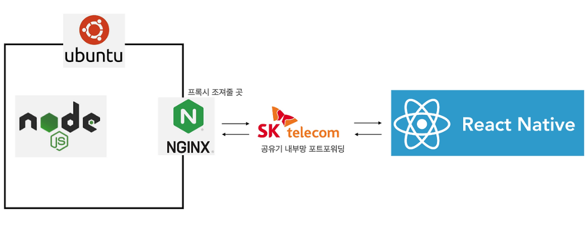
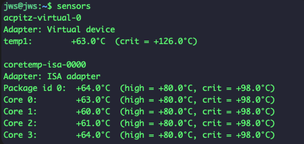
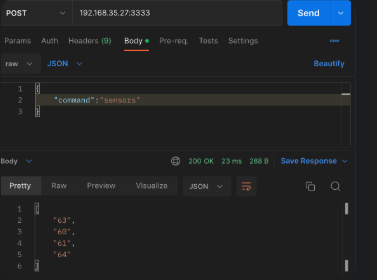
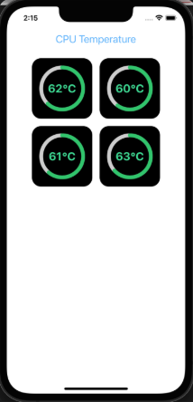
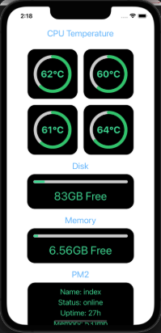

# 남는 PC를 홈서버로 - RN 모니터링 앱 만들기
{: .no_toc }

AWS 비용이 많이 나가는 건 아니지만 내 돈으로 하자니 은근 스트레스다.
프리티어를 돌려쓰는 것도 사실 좀 귀찮아졌고. 그래서 집에서 남는 PC를 NAS 겸
API 서버로 쓰기로 했고, 이왕이면 그걸 들여다볼 앱도 하나 있으면 좋겠다 싶었다.

<details open markdown="block">
  <summary>목차</summary>
  {: .text-delta }
- TOC
{:toc}
</details>

---

## 왜 만들었나

서버는 침대 밑에 숨겨둘 생각이었다. 그런데 침대 프레임 높이가 높지 않아서
기존 케이스를 쓸 수가 없었고, 결국 부품 배치를 좀 바꿨다.


*케이스를 벗기고 눕혔다. 나중에 잘 돌아가면 사이즈 맞춰 케이스를 제작하면 될 것 같다*

소프트웨어적인 CPU나 RAM 점유율 모니터링도 중요하겠지만, 배치가 이렇게 바뀌다 보니
아무래도 **발열에 대한 안정성 검증이 먼저**였다. 케이스 밖으로 꺼낸 보드를
공기도 잘 안 통하는 침대 밑에 두는 거니까.

만드는 건 간단하게 가기로 했다. RN과 Node Express 조합을 쓰고,
결과는 외부 DB에 저장하는 정도.

| 구성 | 선택 | 이유 |
|:--|:--|:--|
| 서버 OS | Ubuntu Server | 이미 깔려 있음 |
| API | Node.js + Express | 제일 빨리 만들 수 있는 조합 |
| 앱 | React Native | 폰으로 침대에서 보려고 |
| 무중단 | PM2 | 프로세스 상태도 같이 보고 싶어서 |


*어차피 같은 PC 안에서 온도를 전달할 API 서버가 돌아갈 거니 구조는 단순하게*

## 온도 읽어오기

Ubuntu 서버에 `sensors` 패키지를 설치하고 찍어보면 CPU의 현재 온도를 알 수 있다.


*물리 코어 4개의 온도와 함께 high / crit 임계값도 같이 나온다*

| 항목 | 값 |
|:--|--:|
| Package id 0 | 64 °C |
| Core 0 ~ 3 | 60 ~ 64 °C |
| high (경고) | 80 °C |
| crit (위험) | 98 °C |

평상시 60도 초반이고 `high`가 80도니 아직 여유는 있어 보인다.
이제 이 숫자를 폰에서 계속 볼 수 있게 만들면 된다.

### 공유기가 80/443을 막아뒀다

바로 변수가 하나 생겼다. 외부에서 확인하기 편하게 80포트와 443포트를 그냥
포트포워딩 해주려 했는데, SK 공유기에서 이미 해당 포트를 막아뒀다.

다른 공유기 모델을 쓰거나 프록시를 세우는 것도 생각해봤지만, 혼자 쓰는 거니
판을 벌리지 않기로 했다. 그냥 다른 포트(3333)를 열어서 쓰고, 나중에 필요해지면
그때 프록시를 붙이면 된다.

### sensors 출력이 그냥 문자열 덩어리다

`sensors` 는 사람이 읽으라고 만든 출력이지 파싱하라고 만든 게 아니다.
`+63.0°C (high = +80.0°C, crit = +98.0°C)` 한 줄에서 내가 원하는 건 `63` 하나뿐이다.

명령어 echo 결과를 스트링으로 가져올 수 있으니, 복잡한 필터 과정을 넣기보단
일단 돌아가게 하는 데만 집중했다.

```ts
if (str.includes("Core 0")) {
  return str.substring(
    str?.indexOf("Core 0")
      ?.match(/\d{2,}/g)
      ?.filter((v: string) => !["80", "98"].includes(v))
  );
}
```

두 자리 이상 숫자를 전부 뽑은 뒤 `80`과 `98`을 걸러내는 방식이다.
`high`와 `crit` 값이 항상 저 두 숫자라는 걸 전제로 한, 대놓고 임시방편인 코드다.

{: .warning }
> 임계값이 80 / 98로 고정된 지금 이 PC에서만 맞는 필터다. CPU가 바뀌면 그대로 깨진다.
> 알면서 그냥 넘어갔다.


*`{"command":"sensors"}` 를 던지면 `["63","60","61","64"]` 가 온다. 200 OK, 23 ms, 288 B*

잘 가공되어 나온다. 응답이 **23 ms에 288 바이트**니, 폰에서 주기적으로 폴링해도
부담될 일은 없어 보인다.

## 화면 구현


*물리 CPU 4개의 온도. 잘 나오긴 하는데...*

물리 CPU 4개의 온도가 잘 나오는 걸 확인하고 나니 이번엔 **UI가 많이 비어 보인다.**
8코어 정도면 또 모를까, 4개로는 화면 위쪽만 채우고 끝이다.

그래서 같은 방식으로 나머지 부가 기능을 채우기로 했다. 어차피 `sensors`나 `df`나
"명령어 때리고 문자열 파싱"이라는 구조는 똑같으니 붙이는 건 금방이었다.

- Disk 여유 용량
- RAM 여유 용량
- PM2로 무중단 배포 중인 앱들의 상태


*CPU 온도 4개, Disk 83GB Free, Memory 6.56GB Free, PM2 프로세스 uptime 27시간*

## 결과

| 항목 | 값 |
|:--|--:|
| CPU 온도 (평상시) | 60 ~ 64 °C |
| 경고 임계값까지 여유 | 약 16 °C |
| API 응답 시간 | 23 ms |
| 응답 크기 | 288 B |
| Disk 여유 | 83 GB |
| Memory 여유 | 6.56 GB |
| PM2 무중단 가동 | 27 h (측정 시점) |

케이스를 벗긴 상태에서도 평상시 60도 초반을 유지했다.
`high` 임계값 80도까지 16도 정도 여유가 있으니, 일단 이 배치로 굴려도 되겠다 싶었다.

<!-- TODO(수치): 여름철 고온 구간에서 며칠 돌린 뒤 최고 온도를 다시 재서 비교표 추가 -->

## 마치며

만들고 나서 제일 좋았던 건 "괜찮겠지" 하고 그냥 넘어갔을 발열을 숫자로 확인했다는 점이다.
케이스도 없이 침대 밑에 밀어 넣으면서 마음 한구석이 계속 불편했는데,
60도라는 숫자를 보고 나니 그제야 마음이 놓였다.

반대로 아쉬운 건 역시 파싱 코드다. `80`과 `98`을 문자열로 걸러내는 건 누가 봐도
임시방편인데, "일단 돌아가게" 만들고 나니 고칠 동기가 슬며시 사라졌다.
이런 게 쌓이는구나 싶다.

AWS 요금 아끼겠다고 시작한 일인데, 지금은 그냥 서버를 직접 들여다보는 재미로 하고 있다.

다음엔 이런 걸 해보면 좋겠다.

- **파싱을 `sensors -j` 로 교체** — lm-sensors는 JSON 출력 옵션이 있다. 정규식 노가다를 걷어낼 수 있다.
- **임계값 알림** — 지금은 내가 앱을 켜야 보인다. 80도를 넘으면 푸시가 오게 하고 싶다.
- **시계열로 쌓기** — 지금은 현재값만 본다. 하루 동안의 온도 그래프를 그리면 언제 뜨거워지는지 알 수 있을 것 같다.
- **케이스 제작** — 사이즈 맞춰 짜면 발열도 배선도 지금보다 나아질 거다.
