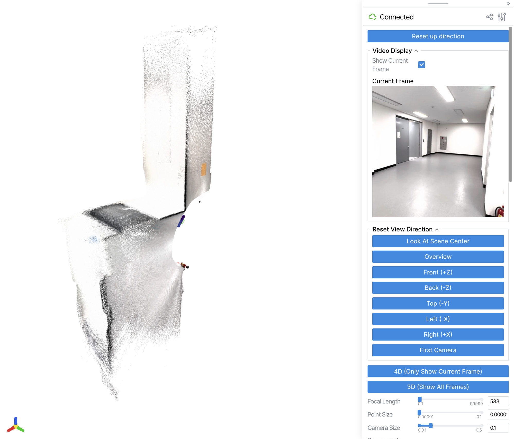
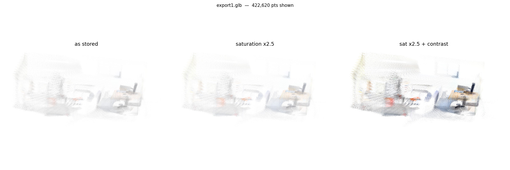
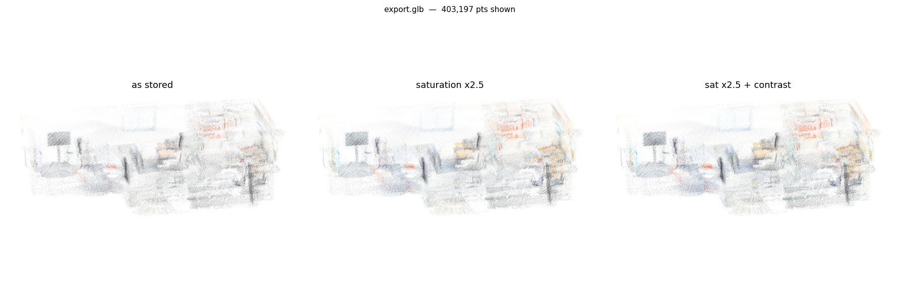

# 영상 한 편으로 3D 맵 만들기 (LingBot-Map)
{: .no_toc }

라이다로 지도를 만드는 건 [앞에서](../hardware/ros-2-slam-map.html) 해봤는데,
이번엔 그냥 **휴대폰으로 찍은 영상 한 편**을 넣으면 3D 공간이 나온다는 걸 써봤다.
결과는 놀라웠고, 그 대가로 24GB VRAM과 며칠 싸웠다.

<details open markdown="block">
  <summary>목차</summary>
  {: .text-delta }
- TOC
{:toc}
</details>

---

## 환경

집 맥북에서 돌릴 수 있는 물건이 아니라, 워크스테이션에 올려두고 Tailscale로 붙어서 썼다.

| 항목 | 값 |
|:--|:--|
| OS | Ubuntu 22.04.5 |
| CPU / RAM | 16 코어 / 62 GB |
| GPU | RTX 3090 **24 GB** (+ 3080 Ti 12 GB) |
| 드라이버 | 535.274.02 (CUDA 12.2) |
| 모델 체크포인트 | 4.6 GB |

이 "드라이버 535"가 뒤에서 한 번 발목을 잡는다.

## 첫 결과

먼저 짧은 영상으로 감을 봤다. 1080 × 1920 세로, 29.97fps, 431프레임짜리 14.4초 클립을
10fps로 샘플링해 144프레임을 넣었다.


*실내 복도와 방의 ㄱ자 구조가 카메라 궤적과 함께 복원됐다*

| 항목 | 값 |
|:--|--:|
| 입력 프레임 | 144 (10 fps 샘플링) |
| 추론 시간 | 62.4 초 (~2.3 it/s) |
| GPU 피크 | 22.2 GB (FlashInfer) / 19.8 GB (SDPA) |

솔직히 좀 놀랐다. 라이다도 없이 폰으로 한 바퀴 돌면서 찍은 영상만으로
벽과 바닥이 제대로 선다. 다만 **144프레임에 벌써 22.2GB**를 쓴다는 게 마음에 걸렸다.

## FlashInfer가 드라이버 535에서 안 돈다

설치하면서 처음 막힌 곳이다.

{: .problem }
> FlashInfer의 JIT 컴파일 커널이 로드는 되는데 실행 시점에 죽는다.
> `BatchPrefillWithPagedKVCache failed with error device kernel image is invalid`

원인은 툴체인 버전 차이였다. conda로 깐 `cuda-nvcc=12.8`이 만든 fatbin에
CUDA 12.8의 `--compress-mode=size` 압축이 걸려 있는데,
**535 드라이버가 이 압축을 못 푼다.**

FlashInfer의 `jit/core.py`에서 그 플래그 하나를 빼고 `~/.cache/flashinfer`를
비우니 정상 동작했다. 이 외에도 두 가지가 더 필요했다.

- `CUDA_HOME=$CONDA_PREFIX` — JIT이 nvcc를 찾게
- `ln -s $CONDA_PREFIX/targets/x86_64-linux/lib $CONDA_PREFIX/lib64` — 링커가 `-lcuda`를 conda 스텁에서 찾게

README 어디에도 없는 내용이라, 드라이버가 오래된 박스에서는 또 나올 문제 같아
따로 적어뒀다.

## 451프레임, 24GB의 벽

다음은 아이폰으로 찍은 45초짜리 워크스루. 1351프레임이라 앞 영상의 3배다.
사무실 → 창고 → 복도로 이어지는 구간이다.

| | 짧은 클립 | 긴 클립 |
|:--|--:|--:|
| 입력 프레임 | 144 | **451** |
| 추론 시간 | 62 초 | **173 초** (2.6 it/s) |
| GPU 피크 | 22.2 GB | **23.19 GB** / 23.69 GB |

23.19GB. 쓸 수 있는 23.69GB 중 거의 다 썼다.
**451프레임이 이 카드의 실측 한계**라는 뜻이다.

포즈 품질도 같이 봤는데, 프레임당 이동량의 최대값이 중앙값의 **10.4배**였다
(짧은 클립은 2.9배). 빠르게 회전하는 구간에서 포즈가 튄다는 얘기고,
실제로 탑뷰에서 벽과 바닥이 좀 번져 보이는 것과 맞아떨어졌다.

### 추론이 끝났는데 VRAM이 안 풀린다

작업하다 `nvidia-smi`를 쳐보니 이런 상태였다.

```
GPU 22,888 MiB  |  RSS 11.8 GB  |  실행 17분 29초  |  GPU-Util 0%
```

GPU 사용률은 0%인데 메모리만 22.9GB를 물고 있다. 이유는 두 가지였다.

1. **viser 뷰어 프로세스가 살아 있다.** 추론이 끝나도 결과를 보여주려고 떠 있는다.
2. **PyTorch caching allocator가 반환을 안 한다.** 피크였던 23.19GB가 `reserved` 상태로 묶여 있고, `torch.cuda.empty_cache()`를 불러야 드라이버에 돌아가는데 `demo.py`는 부르지 않는다.

24GB에서 451프레임이 23.19GB를 쓰니, **두 개는 절대 동시에 못 띄운다.**
다음 실행 전에 이전 뷰어부터 정리하지 않으면 바로 OOM이다.

## 750프레임 — OOM이 난 곳이 힌트였다

451프레임에서 멈추긴 아쉬워서 더 밀어봤다. README는 긴 시퀀스에
`--mode windowed`를 권하는데, 이건 별로 도움이 안 됐다.

단서는 **OOM이 난 위치**였다. attention이 아니라 DPT head(`dpt_head.py`)에서 났다.

{: .problem }
> `--mode windowed`는 창 단위로 **KV 캐시**를 비운다.
> 그런데 실제로 쌓이고 있던 건 KV 캐시가 아니라 **프레임별 예측값**이었다.
> 비우는 대상이 애초에 달랐다.

그래서 예측값을 GPU에 안 쌓게 하는 `--offload_to_cpu`를 붙였더니 바로 뚫렸다.

| 프레임 | 추론 시간 | GPU 피크 | 비고 |
|--:|--:|--:|:--|
| 144 | 62 초 | 22.2 GB | |
| 451 | 173 초 | 23.19 GB | 한계 |
| **750** | **250 초** | **22.5 GB** | `--offload_to_cpu` |
| 999 | — | — | 시도 중 워크스테이션 재부팅 |

750프레임이 451프레임보다 VRAM을 **덜** 쓴다. 호스트 RAM을 16GB 정도 대신 쓰는 대가다.
999프레임은 띄우자마자 워크스테이션이 재부팅됐다. (`up 0 min`을 보고 알았다.)

## 색이 허옇게 날아간 GLB

마지막 삽질. 결과를 `.glb`로 export했는데 색이 전부 허옇게 떴다.


*채도를 2.5배 올리고 대비를 줘도 회색빛이 안 빠진다*

파일을 열어보니 RGB 최소값이 **0.647**이었다. 검은 점이 하나도 없다는 뜻이다.
그런데 alpha 바이트는 255(불투명)로 저장되어 있었다.

여기서 `1 − 0.647 = 0.353`이라는 숫자가 눈에 들어왔다.
**뷰어의 Opacity 슬라이더가 0.35였다.** 반투명하게 보고 있던 화면을 그대로 export하면서
흰 배경이 색에 섞여 들어간 것이다.

{: .warning }
> 더 나쁜 건 파일만 봐서는 알 수 없다는 점이다. alpha는 255라 "불투명한데 색이 허연"
> 상태로 저장되고, 뷰어 설정으로는 절대 되돌릴 수 없다.
> export 전에 Opacity를 1.0으로 올려야 한다.

슬라이더를 되돌리고 다시 뽑으니 RGB 최소값이 0.000이 됐다.


*403,197 포인트. 이제 색이 제대로 나온다*

## 한 방 명령으로 묶기

여기까지 오는 데 매번 수동으로 여섯 단계를 밟았다.
업로드 → 이전 뷰어 종료 → fps 계산 → 추론 → SSH 터널 → 브라우저 열기.
게다가 뒷정리를 잊으면 23GB가 물린 채로 남는다.

그래서 스크립트로 묶었다.

```bash
lingbot ~/Downloads/test7.mp4      # 업로드 → 추론 → 터널 → 브라우저
lingbot --stop                     # GPU 반환
lingbot --status                   # 지금 상태
```

실제 실행이 총 **2분 40초**, 끝나고 `--stop`을 치면 VRAM이 150MiB(디스플레이만)로 돌아온다.

안에 넣어둔 장치가 두 개 있다.

- **프레임 상한 자동 계산** — 영상 길이를 보고 총 프레임이 450을 넘지 않는 fps를 고른다. `demo.py --fps`는 정수만 받고 내부에서 `round(원본fps / fps)` 간격으로 뽑기 때문에, 간격이 아니라 **fps를 역산**해야 한다. 45초 영상이면 8fps → 338프레임.
- **이전 뷰어 자동 종료** — 안 하면 다음 실행이 무조건 OOM이다.

{: .note }
> 451프레임짜리 포인트클라우드는 메시지가 5,933개라 꽤 무겁다.
> Orca 내장 브라우저는 로딩 중 렌더러가 죽어서 Chrome으로 열어야 했다.

## 마치며

폰으로 한 바퀴 돌면서 찍은 영상이 3D 공간이 되어 나오는 건 몇 번을 봐도 신기하다.
[SLAM으로 지도를 만들 때는](../hardware/ros-2-slam-map.html) 로봇을 실제로 굴려야 했는데,
이건 그냥 걸어 다니면서 찍으면 된다.

대신 이번 작업의 대부분은 모델이 아니라 **메모리와의 싸움**이었다.
그중 제일 도움이 됐던 건 "OOM이 어디서 났는지"를 본 것이다.
`--mode windowed`를 계속 만지작거렸는데, 정작 답은
"KV 캐시가 아니라 DPT head에서 터졌다"는 한 줄에 있었다.
**증상만 보고 대책을 고르면 엉뚱한 걸 고치게 된다.**

GLB 색 문제도 비슷했다. 파일에는 alpha 255로 멀쩡하게 적혀 있어서
파일만 봐서는 원인을 못 찾는다. `1 − 0.647 = 0.35`라는 숫자가 슬라이더 값과
맞아떨어지는 걸 보고서야 알았다. 숫자를 끝까지 따라가보는 게 결국 답이었다.

다음엔 이런 걸 해보면 좋겠다.

- **포즈 튐 잡기** — 회전 구간에서 프레임당 이동이 중앙값의 10배까지 튄다. `--mode windowed --window_size 128 --overlap_keyframes 8` 조합과 비교해보고 싶다.
- **라이다 지도와 겹쳐보기** — 같은 공간을 SLAM으로 만든 지도와 이 포인트클라우드를 정합하면 오차가 몇 cm인지 나올 것 같다.
- **AMR에 태워서 촬영** — 사람이 들고 찍으면 흔들림이 크다. [카메라 지그](../hardware/camera-jig-blender.html)에 올려서 일정한 높이·속도로 찍으면 포즈가 훨씬 안정적일 듯하다.
- **더 큰 카드에서 상한 재보기** — 3090 24GB에서 750프레임이 한계였는데, 48GB면 어디까지 가는지.
