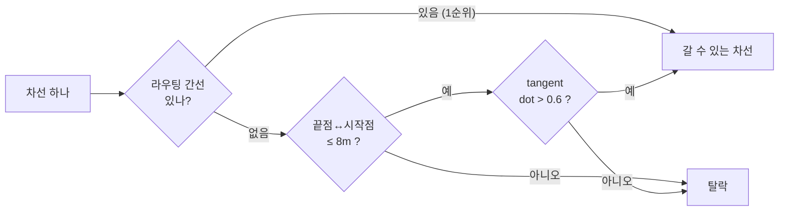

# OpenDRIVE에서 "다음 갈 수 있는 길" 찾기
{: .no_toc }

자율주행 쪽을 만지다 보면 결국 HD맵을 읽어야 한다. OpenDRIVE(`.xodr`)로 된 지도에서
**지금 내 차가 어느 차선에 있고, 여기서 어디로 갈 수 있는가**를 판정하는 로직을
들여다본 기록이다. 붙어 있는데 서로 등지고 있는 도로 때문에 한참 헷갈렸다.

<details open markdown="block">
  <summary>목차</summary>
  {: .text-delta }
- TOC
{:toc}
</details>

---

## OpenDRIVE의 좌표 개념

먼저 용어부터. OpenDRIVE는 도로를 이렇게 표현한다.

| 개념 | 의미 |
|:--|:--|
| road | 도로 하나. 고유 id를 가진다 |
| `s` | 도로를 따라가는 거리 좌표. **도로를 그린 방향**으로 증가한다 |
| lane | 차선. 중심선 기준 **좌측이 양수(+), 우측이 음수(−)** |
| `<link>` | 이 도로/차선이 어느 도로/차선과 이어지는지 |
| junction | 교차로. 어느 차선에서 어느 차선으로 갈 수 있는지 목록 |

여기서 함정은 `s`다. **`s`는 주행 방향이 아니라 도면을 그린 방향**이다.
xodr을 만든 사람이 도로를 왼쪽에서 오른쪽으로 그렸으면 `s`도 그쪽으로 증가하고,
반대로 그렸으면 반대로 증가한다.

## 등지고 붙은 두 도로

문제가 여기서 생긴다. 실제 샘플 맵(`06_junction.xodr`)에 딱 그런 구간이 있었다.

```
  road 8만 반대로 그려져 있다

  road1  s ──────────────▶
                          road5  s ──▶
                          road8  ◀── s          ← 얘만 반대
                                      road2  s ──────────────▶

  x=0                  x=100      x=110                    x=210
```

road 8은 `hdg="3.14159..."`(180°)로 그려져서 `s`가 −X 방향이다.
road 2는 `hdg=0`이라 `s`가 +X 방향. 둘 다 `x=110`에서 `s=0`으로 시작해
**서로 반대로 뻗어나간다.** 이게 "등지고 있다"는 상태다.

xodr에도 그렇게 적혀 있다.

```xml
<road id="8" ...>
  <link>
    <!-- 내 s=0 이 road2의 s=0 에 붙는다 -->
    <predecessor elementType="road" elementId="2" contactPoint="start"/>
  </link>
  <lane id="-1" type="driving">
    <link><predecessor id="1"/></link>   <!-- lane −1 ↔ lane +1, 부호가 뒤집힌다 -->
```

차선 번호까지 뒤집힌다. 이 상태로 "다음에 갈 수 있는 차선"을 찾으려니 머리가 아팠다.

## 1단계 — s를 아예 지워버린다

해법은 생각보다 단순했다. 중심선을 뽑는 시점에 **주행 방향으로 배열을 정규화**하면
그 뒤로는 `s`를 볼 일이 없다.

```js
// 좌측 차선(양수)은 s 증가방향과 주행방향이 반대다
if (meta.lane > 0) pts.reverse();
```

이 한 줄이 전부다. 여기서 뒤집는 건 **점 배열의 순서**뿐이고,
lane id도 좌표도 그대로다. 실제로 찍어보면 이렇다.

```
road 1 (왕복 2차선) — reverse() 적용 후

  lane -1 | pts[0]=(  0, -1.5)  →  pts[n]=(100, -1.5)  | tangent=( 1, 0)   ▶
  lane +1 | pts[0]=(100,  1.5)  →  pts[n]=(  0,  1.5)  | tangent=(-1, 0)   ◀
```

lane +1은 여전히 `y=+1.5`에 있고 tangent도 `(−1, 0)`으로 반대다.
왕복 2차선이 편도가 되어버리는 게 아니라, **배열 순서와 주행 방향의 대응만** 맞춰진 거다.

이게 왜 중요하냐면, 이렇게 해둬야 모든 차선에서
`pts[0]` = 진입점, `pts[n-1]` = 진출점이라고 가정할 수 있기 때문이다.
그래야 "내 **끝점** → 남의 **시작점**"이라는 한 방향 검사가 성립한다.

정규화 후 아까 그 등진 접합부를 다시 보면 이렇게 된다.

| 차선 | 정렬 후 시작점 | 정렬 후 끝점 | 끝방향 |
|:--|:--|:--|:--|
| road 2 lane **+1** | (210.0, 1.5) | **(110.0, 1.5)** | ◀ (−1, 0) |
| road 8 lane **−1** | **(110.0, 1.5)** | (100.0, 1.5) | ◀ (−1, 0) |

road 2의 끝점과 road 8의 시작점이 `(110, 1.5)`에서 정확히 맞물린다.
등지고 있든 말든 상관없어졌다.

## 2단계 — 위상 우선, 기하 폴백

다음 차선을 찾는 건 2순위 구조로 되어 있다.


*1순위는 좌표를 아예 보지 않고, 2순위(기하 폴백)만 거리와 방향을 본다*

### 1순위 — RoutingGraph (위상)

libOpenDRIVE가 xodr을 파싱해서 만들어주는 그래프다.
`get_all_successors()`를 부르면 **`차선키 → 차선키`** 방향성 간선 목록이 나온다.
이 그래프는 이미 아래를 전부 해석해둔 상태다.

- road의 `<predecessor>` / `<successor>`와 `contactPoint`(start / end)
- 각 lane의 `<link><predecessor>` / `<successor>`
- junction의 `<connection><laneLink from to>`

**좌표를 전혀 보지 않는다.** 그래서 gap이 몇십 미터든, 교차로 안이든 정확하다.
실제 출력은 이렇게 생겼다.

```
1:0.000000:-1 | 5:0.000000:-1
5:0.000000:-1 | 2:0.000000:-1
2:0.000000:1  | 8:0.000000:-1     ← 등진 접합도 그냥 나온다
```

{: .warning }
> 전제 조건은 **키 포맷 일치** 하나다. C++ 쪽에서 만드는 키와 JS 쪽 키가
> 한 글자라도 다르면 조회가 전부 `undefined`가 되고,
> **에러 하나 없이 조용히** 라우팅이 통째로 탈락한다.
> 처음 붙일 때 한 번은 찍어서 눈으로 맞춰보는 게 좋다.

### 2순위 — 기하 폴백

라우팅 간선이 하나도 없을 때만 도는 백업이다. 좌표로 판정한다.

```js
const gapSq = (start.x - end.x)**2 + (start.y - end.y)**2;
if (gapSq > gapMax * gapMax) continue;                            // ① 8m 이내
const startDir = normalize2D(...);
if (startDir && dot2D(endDir, startDir) > alignMin) out.add(j);   // ② dot > 0.6
```

| 항목 | 조건 |
|:--|:--|
| 무엇과 무엇 | 내 차선의 **마지막 점** ↔ 상대 차선의 **첫 점** |
| 거리 | 2D 유클리드 **8 m** 이내 (z는 안 봄) |
| 방향 | 두 tangent의 dot > **0.6** (약 53° 이내) |
| 방향성 | 끝 → 시작 한 방향만. 상대의 끝점은 안 봄 |
| 단위 | road가 아니라 **차선(centerline)** 단위 |

### 오탐을 막는 건 거리가 아니라 방향이다

여기서 재밌는 부분. 아까 그 등진 접합부에서 8m 반경을 그려보면
**정답과 오답이 둘 다 원 안에 들어온다.**

| 후보 | gap | dot | 판정 |
|:--|--:|--:|:--|
| road 8 lane −1 (정답) | **0.00 m** | ≈ +1 | 통과 |
| road 2 lane −1 (오답, 반대편 차선) | **3.00 m** | ≈ −1 | 탈락 |

거리로만 보면 3m짜리 오답도 8m 안이라 통과해버린다.
반대 차선으로 역주행하는 경로가 나오는 걸 막아주는 건 **dot 정렬 조건**이다.

## 알아둘 함정 — 폴백은 보완이 아니라 대체다

문서에 없어서 나중에 알게 된 동작이 하나 있다.

```js
if (nexts.size === 0) addGeometricSuccessors(...);   // 하나라도 있으면 실행 안 됨
```

즉, 어떤 차선에 라우팅 간선이 **1개라도** 잡히면 폴백은 아예 돌지 않는다.

{: .problem }
> 예를 들어 좌회전과 직진이 둘 다 가능한 차선인데 xodr에서 직진 링크가 누락됐다면,
> 라우팅 결과가 비어 있지 않으니 1순위에서 끝난다. 폴백이 메워주지 않는다.
> 결과적으로 **좌회전만 되는 차선**으로 표시된다.

전 차선이 통째로 비었을 때(= 키 포맷 불일치 같은 상황)만 사실상 전면 폴백으로 돌아간다.
부분 누락을 잡으려면 두 조건을 `union`으로 바꿔야 하는데,
그러면 이번엔 오탐이 늘어나니 트레이드오프다.

폴백에 **z 게이트**가 없는 것도 걸린다. 지금은 2D 거리만 보기 때문에,
고가도로가 지나가는 지점에서 위아래 도로를 이어버릴 여지가 있다.
`Math.abs(start.z - end.z) <= 1` 정도만 넣어도 막힌다.

## 정리

| 파라미터 | 값 | 의미 |
|:--|--:|:--|
| 중심선 샘플 간격 | 0.6 m | 차선 중심선을 몇 미터 간격으로 뽑을지 |
| `gapMax` | 8 m | 기하 폴백의 끝점-시작점 허용 거리 |
| `alignMin` | 0.6 | tangent dot 하한 (약 53°) |
| 판정 단위 | 차선 | road가 아니라 lane 단위 |

<!-- TODO(수치): 실제 현장 맵에서 1순위(위상)로 잡히는 비율과 폴백으로 떨어지는 비율 -->

## 마치며

제일 오래 헷갈렸던 건 `s` 방향이었다. "도로가 등지고 붙어 있으면 어떻게 되지?",
"lane id 부호가 뒤집히면 왕복 2차선이 편도로 보이는 거 아닌가?" 같은 걸
계속 되물었는데, 답은 **애초에 그걸 안 보게 만들어놨다**는 거였다.
`pts.reverse()` 한 줄로 좌표계 문제를 통째로 없애버린 게 인상적이었다.

두 번째로 배운 건 폴백의 위험함이다. 8m라는 숫자만 보면 넉넉해 보이는데,
실제로는 3m 거리에 역주행 차선이 앉아 있다. 거리 조건은 후보를 줄이는 역할일 뿐이고
진짜 판정은 방향이 한다. **숫자가 커 보인다고 안전한 게 아니다.**

그리고 조용히 실패하는 코드가 제일 무섭다는 것도. 키 포맷이 어긋나면
에러 없이 전 차선이 폴백으로 떨어지는데, 지도가 화면에 잘 그려지니까
한동안 눈치도 못 챈다.

다음엔 이런 걸 해보면 좋겠다.

- **위상 ∪ 기하로 바꿔보기** — 지금은 배타적이라 부분 누락을 못 잡는다. 합집합으로 바꾸면 오탐이 얼마나 늘어나는지 실제 맵으로 재보고 싶다.
- **폴백에 z 게이트 추가** — 고가도로 오연결을 막는 가장 싼 방법이다.
- **키 포맷 검증을 기동 시점에** — 조용히 실패하지 않게, 로드 직후 샘플 몇 개를 대조해서 경고를 띄우는 정도면 충분할 것 같다.
- **xodr 자체를 검증하는 도구** — 링크 누락을 지도 제작 단계에서 잡아내면 이런 폴백이 애초에 덜 필요해진다.
